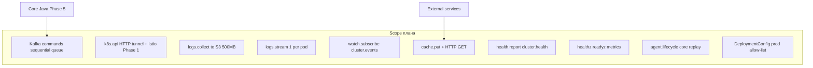
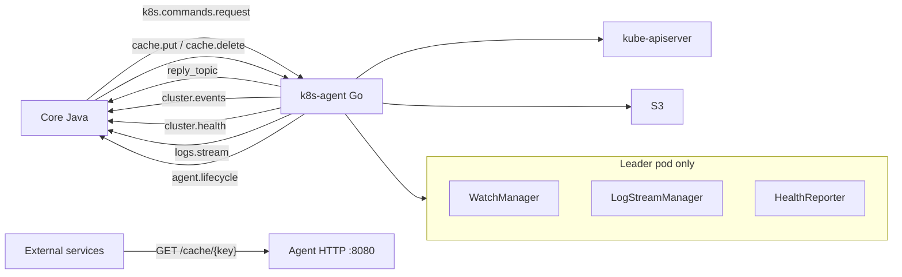
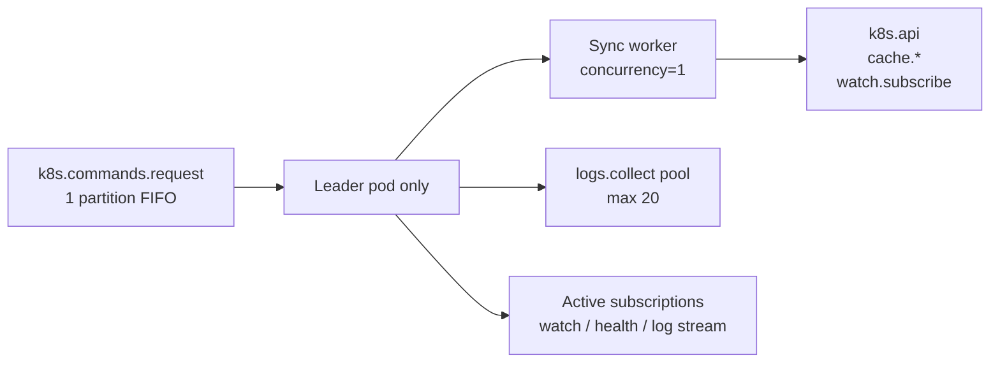
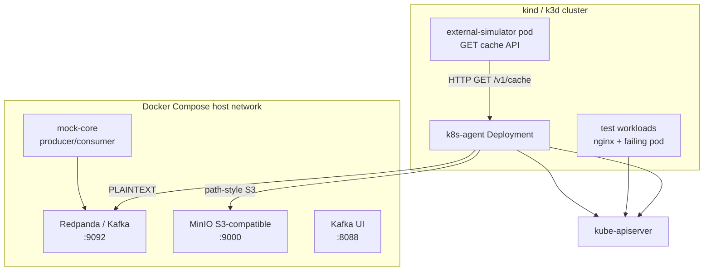

# План реализации k8s-agent (Go, Kafka, локальный кластер)

> **Статус:** согласован, готов к Phase 1.  
> **Приоритет:** этот документ **главнее** [`docs/mvp-plan.md`](docs/mvp-plan.md) и остальных docs там, где они расходятся (sequential queue, `agent.lifecycle`, cache HTTP, scale limits).

## Функциональный scope (итог)

| # | Функция | Kafka / HTTP | Статус в плане |
| --- | --- | --- | --- |
| 1 | CRUD k8s/Istio (fabric8 HTTP tunnel) | `type=k8s.api` → `reply_topic` | Phase 1 |
| 2 | Batch логи → S3 | `logs.collect` → `reply_topic` | Phase 2 |
| 3 | Стрим логов | `logs.stream.start/stop` → `logs.stream` | Phase 4 |
| 4 | Watch Pod/Deploy/DC/Events | `watch.subscribe` → `cluster.events` | Phase 3 |
| 5 | Кэш key-value от ядра | `cache.put/delete` + HTTP `GET /v1/cache/{key}` | Phase 4 |
| 6 | Health pod кластера | `health.report.start/stop` → `cluster.health` | Phase 4 |
| 7 | Health агента | HTTP `/healthz`, `/readyz` | Phase 1 |
| 8 | Core replay после restart | `agent.lifecycle` → core replay subs/cache | Phase 3 |

## Текущее состояние репозитория

Репозиторий [`d:\Project\usmc-k8s-agent`](d:\Project\usmc-k8s-agent) — **только документация**, без Go-кода, манифестов и тестов. Авторитетные источники:

| Документ | Роль |
| --- | --- |
| [`docs/mvp-plan.md`](docs/mvp-plan.md) | MVP scope, зафиксированные решения |
| [`docs/architecture-core-client-k8s-agent.md`](docs/architecture-core-client-k8s-agent.md) | Полная архитектура, диаграммы, контракты |
| [`docs/java-client-design.md`](docs/java-client-design.md) | Java core-client (fabric8 7.7.0) |
| [`docs/k8s-agent-architecture-nup.md`](docs/k8s-agent-architecture-nup.md) | Детали WatchManager/FilePipeline (частично устарел по топикам) |

**Приоритет при конфликтах:** **этот план** > `mvp-plan.md` > `architecture-core-client-k8s-agent.md` > остальные.

---

## Сопоставление требований с документацией (актуально)

Все пункты из первоначального запроса **закрыты в этом плане**:



### 1. Скачивание логов — **batch + stream**

- **Batch:** `logs.collect` → zip → S3 → `s3_bucket`/`s3_key`; hard limit **500 MB**, `truncated: true`, cleanup temp
- **Stream:** `logs.stream.start/stop` → `logs.stream`; max **1 подписка на pod**; batch до 100 строк/msg
- Async pool: **20** параллельных `logs.collect` job

### 2. Подписка на события k8s — **watch.subscribe**

- Pods, Deployments, DeploymentConfig (OpenShift prod), Events, Istio CRD
- Leader-only informers → `cluster.events`
- Kafka key: `{CLUSTER_ID}/{ns}/{group}/{version}/{kind}/{name}`
- Core replay по `agent.lifecycle`

### 3. HTTP API кэша — **cache.put + GET**

- Leader-only in-memory cache + TTL
- HTTP Endpoints только на leader; Bearer + NetworkPolicy

### 4. Healthcheck — **агент + pod кластера**

- Агент: `/healthz`, `/readyz`, Prometheus
- Кластер: `health.report.start` → `cluster.health` (pagination 500 pod/msg)

---

## Целевая архитектура (с расширениями)



### Структура пакетов (финальная)

```
cmd/agent/main.go
internal/config/           # CLUSTER_ID, Kafka TLS, S3, limits
internal/kafka/            # consumer (leader-only), producer, mTLS
internal/command/          # envelope, router, sequential worker
internal/policy/           # allow-list (350 namespaces)
internal/handlers/api/     # type=k8s.api
internal/handlers/logs/    # logs.collect + logs.stream
internal/handlers/cache/   # cache.put/delete
internal/handlers/health/  # health.report
internal/k8s/              # dynamic client, RESTMapper, informers
internal/watch/            # watch.subscribe
internal/cache/            # in-memory store + TTL
internal/http/             # GET /v1/cache, healthz, readyz, metrics
internal/s3/
internal/lifecycle/        # agent.lifecycle publisher
internal/leaderelection/
internal/result/
internal/observability/
deploy/base/ + overlays/local|prod
hack/kind/ + docker-compose.yml + mock-core
test/fixtures/ + test/integration/
```

**Стек:** Go, `segmentio/kafka-go`, `client-go`, `aws-sdk-go-v2`, `prometheus/client_golang`, `log/slog`.

**Kafka контракт (MVP):**
- Request: `k8s.commands.request` (**1 partition** — глобальный FIFO очереди команд)
- Headers: `correlation_id`, `reply_topic`
- Body: `schema_version`, `command_id`, `type`, `payload`, `idempotency_key`, ...
- Semantics: **at-most-once** (commit on receive)
- **Execution:** sync handlers — **строго последовательно** (один worker); только **leader pod** consume commands
- Prod Kafka: **mTLS + ACL**; local dev: PLAINTEXT

---

## Новые компоненты (не в docs)

### A. HTTP Cache API (`internal/cache/` + `internal/http/`)

**Команды от core (Kafka):**

| type | Назначение |
| --- | --- |
| `cache.put` | `{ "entries": [{ "key": "...", "value": "...", "ttl_seconds": 3600 }] }` |
| `cache.delete` | `{ "keys": ["..."] }` |
| `cache.clear` | очистка namespace/prefix (опционально) |

**HTTP API (внутри кластера):**
- `GET /v1/cache/{key}` → `{ "key", "value", "updated_at", "expires_at" }`
- `GET /v1/cache?prefix=...` → список ключей (с лимитом)
- `GET /healthz`, `GET /readyz` — health агента

**Безопасность (зафиксировано):**
- Service + NetworkPolicy: доступ только из разрешённых namespace
- Bearer token из Secret `k8s-agent-http-token` в header `Authorization: Bearer <token>`
- Значения не логировать; запрет Secret-подобных ключей в policy

**Stateless компромисс:** in-memory cache **только на leader pod** + TTL; при failover core replay `cache.put`. Standby не обслуживает cache GET (не в Service Endpoints).

**Leader Endpoints:** leader pod при acquire Lease выставляет label `k8s-agent/leader=true` и регистрирует себя в Endpoints Service `k8s-agent-http`; при loss of leadership — снимает label и удаляет себя из Endpoints.

### B. Log streaming (`internal/handlers/logs/stream.go`)

**Команды:**

| type | Назначение |
| --- | --- |
| `logs.stream.start` | pod/container selector, follow, tailLines, sinceTime |
| `logs.stream.stop` | subscription_id |

**Поток:** отдельный Kafka topic **`logs.stream`** (retention 24h, max 1 MB/msg, batch до 100 строк).

Реализация: `client-go` `Pods().GetLogs().Stream()` per pod/container; leader-only; backpressure через bounded channel; лимиты на concurrent streams.

**Ограничения для resource efficiency:**
- max N concurrent streams (config)
- max bytes/sec per stream
- auto-stop по TTL

### C. Cluster pod health (`internal/health/`)

**Команды:**

| type | Назначение |
| --- | --- |
| `health.report.start` | interval, namespaces (или all), label_selector |
| `health.report.stop` | subscription_id |

**Отчёт:** Kafka topic **`cluster.health`** (пагинация при >500 pod/msg); start/stop подтверждаются в `reply_topic`.

```json
{
  "observed_at": "...",
  "summary": { "total": 120, "running": 110, "pending": 5, "failed": 3, "unknown": 2 },
  "pods": [
    { "namespace": "app", "name": "api-xyz", "phase": "Running", "ready": true, "restart_count": 0, "reason": "" }
  ]
}
```

Реализация: shared Pod informer (переиспользовать из WatchManager) + periodic snapshot; **не** делать LIST all pods каждый раз — только из informer cache после sync.

**Agent self-health:** `/healthz`, `/readyz`, metrics `k8s_agent_kafka_connected`, `k8s_agent_leader`.

### D. DeploymentConfig (OpenShift prod)

```yaml
{ group: apps.openshift.io, version: v1, kind: DeploymentConfig }
```

- **Prod OpenShift:** в allow-list + RBAC
- **CI/kind:** vanilla K8s only, без CRC; DC не тестируется автоматически

---

## Gap analysis (docs → реализация)

| Область | docs | Этот план |
| --- | --- | --- |
| Go-код | нет | Phase 1–5 |
| Sequential command queue | «порядок не требуется» | **1 partition, leader-only, sync worker** |
| HTTP cache API | нет | Phase 4 |
| Log streaming | отложено | Phase 4 |
| Cluster pod health | нет | Phase 4 |
| agent.lifecycle | нет | Phase 3 |
| DeploymentConfig tests | нет | prod only |
| Java core-client | design | Phase 5 |

**Устаревшее в NUP/EIR (не использовать):** DLQ, `commands.results`, `file.fetch`, at-least-once commit-after-result.

---

## Фазы реализации

### Phase 1 — MVP core (~2–3 недели)

1. Go module `github.com/usmc/usmc-k8s-agent` (+ `MODULE` override в Makefile)
2. Kafka consumer/producer: **leader-only**, **1 partition**, sequential sync worker, mTLS config stub
3. Envelope validation + router по `type`
4. Policy engine (ConfigMap allow-list; поддержка **350 namespaces** — файл policy или split ConfigMap)
5. `k8s.api` HTTP proxy + response trimming
6. In-cluster client-go; **Istio CRD** в allow-list с Phase 1
7. Deployment manifests: SA, RBAC (k8s + Istio, no secrets), 2 replicas, probes, metrics
8. kind bootstrap: **istioctl install** для Istio-тестов
9. Unit tests: policy, envelope, trim

### Phase 2 — Logs + S3

1. `logs.collect` handler: async pool (**max 20**), zip hard limit **500 MB**, cleanup on exceed, `truncated` flag
2. S3 upload: AWS + path-style (Ceph/MinIO)
3. Integration tests: MinIO in Compose

### Phase 3 — Watch + events

1. Leader election (Lease)
2. WatchManager + `watch.subscribe/unsubscribe`
3. Publisher `cluster.events` с ordered keys
4. Pod RESTART detection, K8S_EVENT informer
5. DeploymentConfig в allow-list (**prod OpenShift**; CI тесты — vanilla K8s only)

### Phase 4 — Ваши расширения

1. **Cache:** `cache.put/delete` + HTTP `GET /v1/cache/{key}` + replay on restart
2. **Log streaming:** `logs.stream.start/stop` → Kafka topic
3. **Cluster health:** `health.report.start/stop` → periodic pod snapshot
4. HTTP Service + NetworkPolicy для external access
5. Документировать новые команды в `docs/architecture-core-client-k8s-agent.md`

### Phase 5 — Hardening

1. Prometheus metrics
2. Kafka **mTLS + ACL** в deploy overlay prod
3. Rate limiting k8s API calls
4. Chaos tests (pod kill, leader failover → `agent.lifecycle` → core replay)
5. Java core-client (parallel track после контракта)

---

## Принципы надёжности и минимального потребления ресурсов

- **Stateless execution:** dedupe/idempotency на core; agent — executor
- **Shared informers:** один informer на GVK, не per-request
- **Leader-only:** watch, log streams, health reporter, **cache HTTP**
- **Standby pods:** standby **не** consume commands; только leader обрабатывает `k8s.commands.request` (sequential worker)
- **Memory bounds:** TTL cache, max stream count, paginated health reports, trim responses
- **emptyDir** для temp files (logs zip), cleanup после upload
- **Requests/limits (large cluster, 1000+ pod):** leader `cpu: 500m`, `memory: 512Mi–1Gi`; standby `cpu: 100m`, `memory: 128Mi`
- **Command throughput:** sync-команды **строго последовательно**; async `logs.collect` — pool до **20** job

---

## Зафиксированные решения (#1–#20, все закрыты)

| # | Вопрос | Решение |
| --- | --- | --- |
| 1 | Cache при 2+ replicas | Leader-only cache; HTTP Endpoints только leader (`k8s-agent/leader=true`) |
| 2 | Auth HTTP API | NetworkPolicy + Bearer token (`k8s-agent-http-token`) |
| 3 | Health report delivery | Топик `cluster.health`; start/stop → `reply_topic` |
| 4 | Log stream topic | `logs.stream`; retention 24h; 1 MB/msg; batch 100 строк |
| 5 | Scope namespaces | Allow-list до **350** ns; wildcard `*` запрещён |
| 6 | Java core-client | Phase 5, после Go agent |
| 7 | Cache replay | Core replay `cache.put` по `agent.lifecycle` |
| 8 | Standby HTTP | Standby не в Endpoints cache Service |
| 9 | Health pagination | 500 pod/msg, поля `page` / `page_total` |
| 10 | Log stream backpressure | Drop oldest при 1000 строк; metric |
| 11 | Go module path | `github.com/usmc/usmc-k8s-agent`; `go mod edit -module` |
| 12 | Масштаб | 350 ns, 1000+ pod; sequential sync; 1 log stream/pod |
| 13 | OpenShift тесты | CI/kind vanilla only; DC — prod allow-list |
| 14 | Istio | Phase 1 + istioctl в kind |
| 15 | S3 | AWS, Ceph, S3-compatible; `force_path_style` |
| 16 | Kafka prod auth | mTLS + ACL; local PLAINTEXT |
| 17 | cluster_id | `CLUSTER_ID` из конфига |
| 18 | logs.collect limit | 500 MB hard; cleanup; `truncated: true` |
| 19 | Concurrent logs.collect | Default **20** |
| 20 | Core replay trigger | `agent.lifecycle` (restart/failover), не heartbeat |

### Сводка топиков Kafka (финальная)

| Топик | Направление | Назначение |
| --- | --- | --- |
| `k8s.commands.request` | core → agent | Все команды |
| `reply_topic` (header) | agent → core | Sync ответы |
| `cluster.events` | agent → core | Watch-события |
| `logs.stream` | agent → core | Стрим логов (batched) |
| `cluster.health` | agent → core | Periodic pod health snapshots |
| `agent.lifecycle` | agent → core | Restart/leader change для core replay |

### HTTP API агента (финальная)

| Endpoint | Доступ | Auth |
| --- | --- | --- |
| `GET /v1/cache/{key}` | Только leader Endpoints | NetworkPolicy + Bearer |
| `GET /v1/cache?prefix=` | Только leader | NetworkPolicy + Bearer |
| `GET /healthz` | Все pod | Без auth (liveness) |
| `GET /readyz` | Все pod | Без auth (readiness) |
| `GET /metrics` | Prometheus scrape | NetworkPolicy (monitoring ns) |

Secret для Bearer: `k8s-agent-http-token` в namespace `k8s-agent`.

### Типы команд Kafka (полный перечень)

| type | Sync/Async | Phase |
| --- | --- | --- |
| `k8s.api` | Sync | 1 |
| `logs.collect` | Async (pool 20) | 2 |
| `watch.subscribe` / `watch.unsubscribe` | Sync dispatch | 3 |
| `cache.put` / `cache.delete` / `cache.clear` | Sync | 4 |
| `logs.stream.start` / `logs.stream.stop` | Sync dispatch | 4 |
| `health.report.start` / `health.report.stop` | Sync dispatch | 4 |

### Модель выполнения команд (sequential queue)



| Тип команды | Поведение в очереди |
| --- | --- |
| `k8s.api`, `cache.*`, `watch.subscribe`, `health.report.start`, … | Sync worker: **одна за другой** |
| `logs.collect` | Commit → spawn async job (≤20 parallel) → worker берёт следующую команду |
| `logs.stream.start` | Commit → register subscription (1 per pod max) → next command |
| Watch/health events | Out-of-band в `cluster.events` / `cluster.health`; **не** через command queue |

**Снижение RPS:** core подписывается на `cluster.events` / `cluster.health` / `logs.stream` вместо polling `k8s.api` GET/LIST.

### Agent lifecycle event (для core replay)

При старте leader pod публикует в Kafka (topic **`agent.lifecycle`**, 1 msg per start):

```json
{
  "schema_version": "v1",
  "event_type": "agent.started",
  "cluster_id": "prod-eu-1",
  "agent_instance_id": "k8s-agent-abc12",
  "leader": true,
  "observed_at": "2026-07-05T00:00:00Z"
}
```

Core на `agent.started` / `agent.leader.changed` переотправляет активные подписки и cache.

### S3 client config (multi-provider)

```yaml
s3:
  endpoint: ""          # empty = AWS default
  region: eu-central-1
  force_path_style: true  # true for Ceph/MinIO
```

### Kafka prod TLS (sketch)

```yaml
kafka:
  brokers: ["kafka:9093"]
  tls:
    enabled: true
    ca_file: /etc/kafka/ca.crt
    cert_file: /etc/kafka/client.crt
    key_file: /etc/kafka/client.key
  # ACL: agent SA/principal → READ k8s.commands.request, WRITE reply topics + event topics
```

---

## Примеры Kafka-запросов по функциональности

### Общие правила для всех команд

**Топик запроса:** `k8s.commands.request`

**Kafka headers (обязательны):**

```text
correlation_id = corr-550e8400-e29b-41d4-a716-446655440001
reply_topic    = core-client.dev-01.responses
```

**Общие поля body:**

| Поле | Описание |
| --- | --- |
| `schema_version` | `"v1"` |
| `command_id` | UUID команды (аудит) |
| `type` | тип handler |
| `issuer` | `"core-client"` (только аудит) |
| `idempotency_key` | стабильный ключ для retry/dedupe на core |
| `timeout` | `"30s"`, `"10m"` и т.д. |
| `issued_at` | ISO8601 UTC |

**Ответ** всегда публикуется в `reply_topic` из headers с тем же `correlation_id`.

**Event-топики (без reply):**

| Топик | Назначение |
| --- | --- |
| `cluster.events` | watch-события ресурсов |
| `logs.stream` | строки логов в реальном времени |
| `cluster.health` | периодические snapshot pod health |

---

### 1. Generic CRUD через HTTP-туннель (`k8s.api`)

#### GET Deployment

```json
{
  "schema_version": "v1",
  "command_id": "cmd-001-get-deploy",
  "type": "k8s.api",
  "issuer": "core-client",
  "idempotency_key": "payments/apps/v1/deployments/api/get",
  "timeout": "30s",
  "issued_at": "2026-07-04T20:00:00Z",
  "http": {
    "method": "GET",
    "path": "/apis/apps/v1/namespaces/payments/deployments/api",
    "headers": {
      "Accept": "application/json"
    }
  }
}
```

**Ответ (фрагмент):**

```json
{
  "schema_version": "v1",
  "command_id": "cmd-001-get-deploy",
  "correlation_id": "corr-550e8400-e29b-41d4-a716-446655440001",
  "status": "completed",
  "http_status": 200,
  "http_body": { "apiVersion": "apps/v1", "kind": "Deployment", "metadata": { "name": "api", "resourceVersion": "123456" } },
  "started_at": "2026-07-04T20:00:01Z",
  "finished_at": "2026-07-04T20:00:01Z",
  "error": null
}
```

#### PATCH scale (абсолютное значение replicas)

```json
{
  "schema_version": "v1",
  "command_id": "cmd-002-scale",
  "type": "k8s.api",
  "issuer": "core-client",
  "idempotency_key": "payments/apps/v1/deployments/api/scale/3",
  "timeout": "30s",
  "issued_at": "2026-07-04T20:00:00Z",
  "http": {
    "method": "PATCH",
    "path": "/apis/apps/v1/namespaces/payments/deployments/api/scale",
    "headers": {
      "Content-Type": "application/merge-patch+json"
    },
    "body": "{\"spec\":{\"replicas\":3}}"
  }
}
```

#### LIST Pods по label selector

```json
{
  "schema_version": "v1",
  "command_id": "cmd-003-list-pods",
  "type": "k8s.api",
  "issuer": "core-client",
  "idempotency_key": "payments/v1/pods/list/app=api",
  "timeout": "30s",
  "issued_at": "2026-07-04T20:00:00Z",
  "http": {
    "method": "GET",
    "path": "/api/v1/namespaces/payments/pods?labelSelector=app%3Dapi&limit=100",
    "headers": { "Accept": "application/json" }
  }
}
```

#### GET DeploymentConfig (OpenShift)

```json
{
  "schema_version": "v1",
  "command_id": "cmd-004-get-dc",
  "type": "k8s.api",
  "issuer": "core-client",
  "idempotency_key": "app/apps.openshift.io/v1/deploymentconfigs/processor/get",
  "timeout": "30s",
  "issued_at": "2026-07-04T20:00:00Z",
  "http": {
    "method": "GET",
    "path": "/apis/apps.openshift.io/v1/namespaces/app/deploymentconfigs/processor",
    "headers": { "Accept": "application/json" }
  }
}
```

---

### 2. Batch-сбор логов → S3 (`logs.collect`)

```json
{
  "schema_version": "v1",
  "command_id": "cmd-010-logs-collect",
  "type": "logs.collect",
  "issuer": "core-client",
  "idempotency_key": "logs/payments/app-api/2026-07-04T20",
  "timeout": "10m",
  "issued_at": "2026-07-04T20:00:00Z",
  "payload": {
    "namespace": "payments",
    "label_selector": "app=api",
    "containers": "all",
    "include_current": true,
    "include_previous": true,
    "since_time": "2026-07-04T19:00:00Z",
    "tail_lines": 10000,
    "limit_bytes": 104857600,
    "s3": {
      "bucket": "logs-bundles",
      "key": "logs/2026/07/04/cmd-010-logs-collect.zip",
      "access_key_id": "MINIO_ACCESS_KEY",
      "secret_access_key": "MINIO_SECRET_KEY"
    }
  }
}
```

**Альтернатива — явный список pod:**

```json
{
  "payload": {
    "namespace": "payments",
    "pods": ["api-7d4f8b-abc12", "api-7d4f8b-def34"],
    "containers": ["app", "sidecar"],
    "include_current": true,
    "include_previous": false,
    "s3": { "bucket": "logs-bundles", "key": "logs/2026/07/04/manual.zip", "access_key_id": "...", "secret_access_key": "..." }
  }
}
```

**Ответ:**

```json
{
  "schema_version": "v1",
  "command_id": "cmd-010-logs-collect",
  "correlation_id": "corr-550e8400-e29b-41d4-a716-446655440001",
  "status": "completed",
  "s3_bucket": "logs-bundles",
  "s3_key": "logs/2026/07/04/cmd-010-logs-collect.zip",
  "byte_size": 7340032,
  "file_count": 18,
  "partial_errors": [
    { "pod": "api-7d4f8b-xyz99", "container": "app", "reason": "ContainerNotFound" }
  ],
  "truncated": false,
  "started_at": "2026-07-04T20:00:01Z",
  "finished_at": "2026-07-04T20:02:15Z",
  "error": null
}
```

**Ответ при превышении лимита 500 MB (`truncated: true`):**

```json
{
  "status": "completed",
  "s3_bucket": "logs-bundles",
  "s3_key": "logs/2026/07/04/cmd-010-logs-collect.zip",
  "byte_size": 524288000,
  "file_count": 12,
  "truncated": true,
  "partial_errors": [
    { "reason": "SizeLimitExceeded", "message": "Bundle reached 500 MB hard limit; remaining pods skipped" }
  ]
}
```

---

#### Start

```json
{
  "schema_version": "v1",
  "command_id": "cmd-020-stream-start",
  "type": "logs.stream.start",
  "issuer": "core-client",
  "idempotency_key": "stream/payments/api/pod-abc/app",
  "timeout": "24h",
  "issued_at": "2026-07-04T20:00:00Z",
  "payload": {
    "subscription_id": "logstream-sub-001",
    "namespace": "payments",
    "pod": "api-7d4f8b-abc12",
    "container": "app",
    "follow": true,
    "tail_lines": 100,
    "since_seconds": 300,
    "output_topic": "logs.stream",
    "ttl_seconds": 3600
  }
}
```

**Ответ (подтверждение подписки):**

```json
{
  "schema_version": "v1",
  "command_id": "cmd-020-stream-start",
  "correlation_id": "corr-550e8400-e29b-41d4-a716-446655440001",
  "status": "completed",
  "subscription_id": "logstream-sub-001",
  "output_topic": "logs.stream",
  "started_at": "2026-07-04T20:00:01Z",
  "finished_at": "2026-07-04T20:00:01Z",
  "error": null
}
```

**Сообщения в топике `logs.stream` (без reply):**

```json
{
  "schema_version": "v1",
  "subscription_id": "logstream-sub-001",
  "namespace": "payments",
  "pod": "api-7d4f8b-abc12",
  "container": "app",
  "timestamp": "2026-07-04T20:00:05.123Z",
  "line": "2026-07-04T20:00:05 INFO Request handled path=/health"
}
```

Kafka key: `local/payments/v1/pod/api-7d4f8b-abc12/container/app`

#### Stop

```json
{
  "schema_version": "v1",
  "command_id": "cmd-021-stream-stop",
  "type": "logs.stream.stop",
  "issuer": "core-client",
  "idempotency_key": "stream/stop/logstream-sub-001",
  "timeout": "30s",
  "issued_at": "2026-07-04T21:00:00Z",
  "payload": {
    "subscription_id": "logstream-sub-001"
  }
}
```

---

### 4. Watch подписки на события k8s (`watch.subscribe` / `watch.unsubscribe`)

#### Subscribe — Pods

```json
{
  "schema_version": "v1",
  "command_id": "cmd-030-watch-pods",
  "type": "watch.subscribe",
  "issuer": "core-client",
  "idempotency_key": "watch/sub-pods-payments-api",
  "timeout": "24h",
  "issued_at": "2026-07-04T20:00:00Z",
  "payload": {
    "subscription_id": "sub-pods-payments-api",
    "gvk": { "group": "", "version": "v1", "kind": "Pod" },
    "namespace": "payments",
    "label_selector": "app=api",
    "event_filter": ["ADDED", "MODIFIED", "DELETED", "RESTART"],
    "output_topic": "cluster.events",
    "ttl_seconds": 86400
  }
}
```

#### Subscribe — Deployments

```json
{
  "schema_version": "v1",
  "command_id": "cmd-031-watch-deploy",
  "type": "watch.subscribe",
  "issuer": "core-client",
  "idempotency_key": "watch/sub-deploy-payments",
  "timeout": "24h",
  "issued_at": "2026-07-04T20:00:00Z",
  "payload": {
    "subscription_id": "sub-deploy-payments",
    "gvk": { "group": "apps", "version": "v1", "kind": "Deployment" },
    "namespace": "payments",
    "label_selector": "",
    "event_filter": ["ADDED", "MODIFIED", "DELETED"],
    "output_topic": "cluster.events"
  }
}
```

#### Subscribe — DeploymentConfig (OpenShift)

```json
{
  "payload": {
    "subscription_id": "sub-dc-app",
    "gvk": { "group": "apps.openshift.io", "version": "v1", "kind": "DeploymentConfig" },
    "namespace": "app",
    "label_selector": "app=processor",
    "event_filter": ["ADDED", "MODIFIED", "DELETED"],
    "output_topic": "cluster.events"
  }
}
```

#### Subscribe — Kubernetes Events

```json
{
  "payload": {
    "subscription_id": "sub-k8s-events",
    "gvk": { "group": "", "version": "v1", "kind": "Event" },
    "namespace": "payments",
    "field_selector": "involvedObject.kind=Pod",
    "event_filter": ["K8S_EVENT"],
    "output_topic": "cluster.events"
  }
}
```

**Событие в `cluster.events`:**

```json
{
  "schema_version": "v1",
  "subscription_id": "sub-pods-payments-api",
  "event_type": "RESTART",
  "resource": {
    "group": "",
    "version": "v1",
    "kind": "Pod",
    "namespace": "payments",
    "name": "api-7d4f8b-abc12"
  },
  "observed_at": "2026-07-04T20:05:00Z",
  "details": {
    "container": "app",
    "restart_count": 3,
    "reason": "Error"
  }
}
```

Kafka key: `local/payments/v1/pod/api-7d4f8b-abc12`

#### Unsubscribe

```json
{
  "schema_version": "v1",
  "command_id": "cmd-032-watch-unsub",
  "type": "watch.unsubscribe",
  "issuer": "core-client",
  "idempotency_key": "watch/unsub/sub-pods-payments-api",
  "timeout": "30s",
  "issued_at": "2026-07-04T22:00:00Z",
  "payload": {
    "subscription_id": "sub-pods-payments-api"
  }
}
```

---

### 5. Кэш key-value от ядра (`cache.put` / `cache.delete`)

> HTTP GET — не через Kafka; см. §6.

#### Put (один или несколько ключей)

```json
{
  "schema_version": "v1",
  "command_id": "cmd-040-cache-put",
  "type": "cache.put",
  "issuer": "core-client",
  "idempotency_key": "cache/feature-flags/v42",
  "timeout": "30s",
  "issued_at": "2026-07-04T20:00:00Z",
  "payload": {
    "entries": [
      {
        "key": "feature/payments/new-checkout",
        "value": "enabled",
        "ttl_seconds": 3600
      },
      {
        "key": "config/rate-limit/rps",
        "value": "100",
        "ttl_seconds": 86400
      }
    ]
  }
}
```

**Ответ:**

```json
{
  "schema_version": "v1",
  "command_id": "cmd-040-cache-put",
  "correlation_id": "corr-550e8400-e29b-41d4-a716-446655440001",
  "status": "completed",
  "keys_written": 2,
  "started_at": "2026-07-04T20:00:01Z",
  "finished_at": "2026-07-04T20:00:01Z",
  "error": null
}
```

#### Delete

```json
{
  "schema_version": "v1",
  "command_id": "cmd-041-cache-delete",
  "type": "cache.delete",
  "issuer": "core-client",
  "idempotency_key": "cache/delete/feature/payments/new-checkout",
  "timeout": "30s",
  "issued_at": "2026-07-04T21:00:00Z",
  "payload": {
    "keys": ["feature/payments/new-checkout"]
  }
}
```

---

### 6. HTTP API кэша (не Kafka — для внешних сервисов)

Внешний сервис внутри кластера обращается к Service агента:

```http
GET /v1/cache/feature/payments/new-checkout HTTP/1.1
Host: k8s-agent.k8s-agent.svc.cluster.local:8080
Accept: application/json
Authorization: Bearer <token-from-secret>
```

**Ответ:**

```json
{
  "key": "feature/payments/new-checkout",
  "value": "enabled",
  "updated_at": "2026-07-04T20:00:01Z",
  "expires_at": "2026-07-04T21:00:01Z"
}
```

**Health агента (HTTP, не Kafka):**

```http
GET /healthz HTTP/1.1   → 200 {"status":"ok"}
GET /readyz  HTTP/1.1   → 200 {"kafka":"connected","leader":true}
```

---

### 7. Healthcheck pod кластера (`health.report.start` / `health.report.stop`)

#### Start periodic report

```json
{
  "schema_version": "v1",
  "command_id": "cmd-050-health-start",
  "type": "health.report.start",
  "issuer": "core-client",
  "idempotency_key": "health/report/all-pods",
  "timeout": "24h",
  "issued_at": "2026-07-04T20:00:00Z",
  "payload": {
    "subscription_id": "health-sub-001",
    "interval_seconds": 60,
    "namespaces": ["payments", "app"],
    "label_selector": "",
    "include_not_ready_only": false,
    "output_topic": "cluster.health",
    "max_pods_per_message": 500
  }
}
```

**Ответ (подтверждение):**

```json
{
  "status": "completed",
  "subscription_id": "health-sub-001",
  "output_topic": "cluster.health",
  "interval_seconds": 60
}
```

**Сообщение в `cluster.health` (каждые 60s):**

```json
{
  "schema_version": "v1",
  "subscription_id": "health-sub-001",
  "observed_at": "2026-07-04T20:01:00Z",
  "summary": {
    "total": 42,
    "running": 38,
    "pending": 2,
    "failed": 1,
    "succeeded": 1,
    "unknown": 0,
    "not_ready": 3
  },
  "pods": [
    {
      "namespace": "payments",
      "name": "api-7d4f8b-abc12",
      "phase": "Running",
      "ready": true,
      "restart_count": 0,
      "reason": "",
      "message": ""
    },
    {
      "namespace": "payments",
      "name": "worker-9x2-fail01",
      "phase": "Running",
      "ready": false,
      "restart_count": 5,
      "reason": "CrashLoopBackOff",
      "message": "back-off 5m0s restarting failed container"
    }
  ]
}
```

#### Stop

```json
{
  "schema_version": "v1",
  "command_id": "cmd-051-health-stop",
  "type": "health.report.stop",
  "issuer": "core-client",
  "idempotency_key": "health/stop/health-sub-001",
  "timeout": "30s",
  "issued_at": "2026-07-04T23:00:00Z",
  "payload": {
    "subscription_id": "health-sub-001"
  }
}
```

---

### 8. Ответ при отклонении policy (`rejected`)

```json
{
  "schema_version": "v1",
  "command_id": "cmd-bad-secret",
  "correlation_id": "corr-550e8400-e29b-41d4-a716-446655440001",
  "status": "rejected",
  "reason": "PolicyDenied",
  "error": {
    "code": "FORBIDDEN_RESOURCE",
    "message": "Secret access is not allowed"
  },
  "started_at": "2026-07-04T20:00:01Z",
  "finished_at": "2026-07-04T20:00:01Z"
}
```

---

## Тестовый контур

### Можно ли протестировать в Docker Compose?

**Короткий ответ:** полностью в одном `docker-compose.yml` — **нет**, потому что агент по design работает **in-cluster** (ServiceAccount token, RBAC, доступ к kube-apiserver, leader election через Lease). Но **гибридный локальный контур** покрывает ~95% функционала без managed Kafka и AWS S3.



| Компонент prod | Локальная замена | Где запускать |
| --- | --- | --- |
| Managed Kafka | Redpanda (single node) или Bitnami Kafka | Docker Compose |
| AWS S3 | MinIO | Docker Compose |
| Kubernetes | kind или k3d | Docker (отдельно от compose) |
| k8s-agent | Deployment in kind | kind cluster |
| core-client Java | `mock-core` Go/Python CLI или kafka-console | Compose или host |
| Istio CRD | **istioctl install** в kind bootstrap (Phase 1+) | kind |
| OpenShift DeploymentConfig | **prod allow-list**; CI/kind — **vanilla K8s only**, без CRC | prod OpenShift |
| NetworkPolicy egress | упрощённо отключить или kind CNI | kind |

### Рекомендуемая структура репозитория

```
usmc-k8s-agent/
├── docker-compose.yml          # Kafka + MinIO + Kafka UI + mock-core
├── hack/
│   ├── kind-config.yaml        # extraPortMappings, containerd config
│   ├── bootstrap.sh            # kind create + load image + apply manifests
│   └── mock-core/              # CLI: send command, wait response
├── deploy/
│   ├── base/                   # agent Deployment, SA, RBAC, Service
│   └── overlays/
│       ├── local/              # Kafka=host.docker.internal:9092, MinIO endpoint
│       └── prod/               # managed Kafka, AWS S3
├── test/
│   ├── fixtures/               # sample workloads, test pods with logs
│   └── integration/            # e2e scripts against kind
└── ...
```

### docker-compose.yml (минимальный скелет)

```yaml
services:
  redpanda:
    image: redpandadata/redpanda:v24.2.4
    command:
      - redpanda start
      - --overprovisioned
      - --smp 1
      - --memory 512M
      - --kafka-addr PLAINTEXT://0.0.0.0:9092
      - --advertise-kafka-addr PLAINTEXT://host.docker.internal:9092
    ports:
      - "9092:9092"

  minio:
    image: minio/minio:RELEASE.2024-09-22T00-33-43Z
    command: server /data --console-address ":9001"
    environment:
      MINIO_ROOT_USER: minioadmin
      MINIO_ROOT_PASSWORD: minioadmin
    ports:
      - "9000:9000"
      - "9001:9001"

  minio-init:
    image: minio/mc
    depends_on: [minio]
    entrypoint: >
      /bin/sh -c "
      mc alias set local http://minio:9000 minioadmin minioadmin &&
      mc mb -p local/logs-bundles || true
      "

  kafka-ui:
    image: provectuslabs/kafka-ui:latest
    ports: ["8088:8080"]
    environment:
      KAFKA_CLUSTERS_0_NAME: local
      KAFKA_CLUSTERS_0_BOOTSTRAPSERVERS: redpanda:9092
```

### Подключение kind к Compose

1. `kind create cluster --config hack/kind-config.yaml`
2. Агент в kind подключается к Kafka/MinIO на хосте:
   - `KAFKA_BROKERS=host.docker.internal:9092` (на Linux: IP docker bridge или `extra_hosts`)
   - `S3_ENDPOINT=http://host.docker.internal:9000`
3. `kind load docker-image k8s-agent:dev` → `kubectl apply -k deploy/overlays/local`
4. Создать топики: `k8s.commands.request` (**1 partition**), `core-client.dev.responses`, `cluster.events`, `logs.stream`, `cluster.health`, `agent.lifecycle`

### Уровни тестирования

| Уровень | Что проверяет | Инфраструктура |
| --- | --- | --- |
| **Unit** | policy, envelope, trim, cache TTL | `go test`, fake clients |
| **Integration (Compose)** | Kafka produce/consume, MinIO upload | Compose + mock handler без K8s |
| **Integration (kind)** | k8s.api, logs.collect, watch, health | kind + Compose |
| **E2E smoke** | полный сценарий core → agent → S3 → response | kind + mock-core script |
| **Staging** | managed Kafka + real K8s + AWS S3 | prod-like |
| **OpenShift-only** | DeploymentConfig watch/CRUD | CRC или dev cluster |

### Dev-mode без kind (быстрый цикл)

Для разработки handler-ов можно запускать агент **локально** с `KUBECONFIG` (не in-cluster):

```bash
KUBECONFIG=~/.kube/config \
KAFKA_BROKERS=localhost:9092 \
S3_ENDPOINT=http://localhost:9000 \
go run ./cmd/agent
```

Ограничения: нет SA token flow, leader election можно отключить флагом `--dev-no-leader-election`, NetworkPolicy не тестируется. **Перед релизом — обязательный прогон in-cluster в kind.**

### mock-core для ручного теста

Простой CLI (`hack/mock-core`):

1. Создаёт `correlation_id`, слушает `reply_topic`
2. Публикует JSON в `k8s.commands.request` с headers
3. Ждёт ответ ≤ timeout, печатает result
4. Для watch/health/logs.stream — параллельно consumer на event topics

Пример вызова (после реализации):

```bash
./hack/mock-core send --type logs.collect --file test/fixtures/logs-collect.json
./hack/mock-core listen --topic cluster.events
curl http://localhost:8080/v1/cache/feature/test  # port-forward k8s-agent Service
```

### Что Compose **не** покрывает без доп. усилий

- TLS/SASL на Kafka (в prod managed) — тестировать отдельно на staging
- AWS IAM roles for SA (IRSA) — в kind использовать static MinIO keys
- Multi-replica consumer rebalance под нагрузкой — chaos test в kind
- OpenShift DeploymentConfig — отдельный кластер
- Egress proxy, подписывающий HTTP headers (presigned URL problem) — staging only

### Рекомендация

**Основной dev/staging контур:** `docker-compose` (Kafka + MinIO + UI) + **kind** (агент + istioctl + test workloads).

---

## Финальная конфигурация агента (defaults)

```yaml
# ConfigMap k8s-agent-config
cluster_id: "prod-eu-1"          # CLUSTER_ID для Kafka keys

kafka:
  brokers: ["kafka:9093"]
  request_topic: "k8s.commands.request"
  request_partitions: 1          # FIFO
  events_topic: "cluster.events"
  logs_stream_topic: "logs.stream"
  health_topic: "cluster.health"
  lifecycle_topic: "agent.lifecycle"
  consumer_group: "k8s-agent"
  commit_on_receive: true        # at-most-once
  tls:
    enabled: false               # true в overlay prod

s3:
  endpoint: ""                   # AWS default; http://minio:9000 local
  region: eu-central-1
  force_path_style: false        # true для Ceph/MinIO

agent:
  leader_election: true
  leader_only_commands: true
  sync_worker_concurrency: 1
  logs_collect_max_jobs: 20
  logs_collect_max_bytes: 524288000   # 500 MB
  log_stream_max_per_pod: 1
  log_stream_buffer_lines: 1000
  health_max_pods_per_message: 500
  http_port: 8080

policy:
  allowed_namespaces_file: /etc/policy/namespaces.yaml   # до 350 ns
  allowed_gvk: [...]               # k8s + istio + deploymentconfig
  secrets_denied: true

resources:
  leader:  { cpu: 500m, memory: 512Mi }
  standby: { cpu: 100m, memory: 128Mi }
```

### Checklist готовности к Phase 1

- [ ] Все решения #1–#20 приняты (этот документ)
- [ ] `go mod init github.com/usmc/usmc-k8s-agent`
- [ ] `docker-compose up` + `kind create` + topic bootstrap
- [ ] Deploy agent overlay/local
- [ ] mock-core: `k8s.api` GET + reply

**Следующий шаг:** выполнение Phase 1 по команде «начни реализацию».
