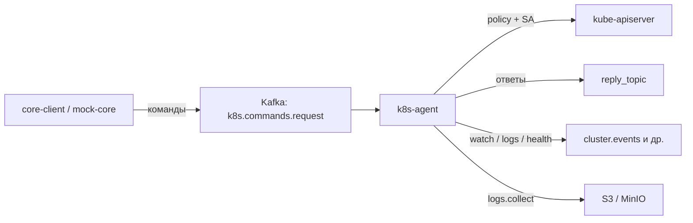

# Обзор Go-кода k8s-agent (для контролеров)

Документ описывает **что делает агент** и **за что отвечает каждый Go-файл** актуального модуля (корень репозитория: `cmd/agent` + `internal/`).

Папка `k8s-agent/` — более ранняя/параллельная реализация; в проде и локальном контуре сейчас используется корневой модуль.

---

## Что делает агент (одной фразой)

**Агент — in-cluster Go-сервис, который принимает команды из Kafka, проверяет их по политике (allow-list), выполняет операции в Kubernetes от имени своего ServiceAccount и возвращает ответы/события обратно в Kafka.**

Java/core **не** ходит в kube-apiserver напрямую: нет kubeconfig и credentials на стороне приложений.

**Ключевые свойства:**

- **Defense-in-depth:** RBAC ServiceAccount + YAML allow-list (namespaces, GVK, verbs, issuers, reply topics).
- **Secret запрещены** на уровне политики.
- **Commit-on-receive** → семантика MVP: at-most-once (повтор — со стороны core по timeout).
- **Leader election:** только лидер читает команды и держит watch/stream/health подписки.

---

## Режимы запуска (`AGENT_COMPONENT`)

| Режим | Смысл |
| --- | --- |
| `all` (по умолчанию) | Один процесс: Kafka + HTTP + исполнение команд |
| `ingress` | Внешний HTTP-прокси к agent-service |
| `egress` | Читает Kafka, форвардит команды в agent-service по HTTP |
| `agent-service` | Исполняет команды (Kafka или internal HTTP), лидер публикует lifecycle |

---

## Точка входа

### `cmd/agent/main.go`

Старт процесса: JSON-логи, флаг `--dev-no-leader-election`, сборка `agent.App`, обработка SIGINT/SIGTERM.

---

## Сборка и жизненный цикл

### `internal/agent/app.go`

**«Дирижёр».** Собирает все зависимости: config, k8s, policy, Kafka publisher, watch/logstream/health managers, handlers → router, HTTP server.

По `features` включает только разрешённые типы команд.

`Run()` выбирает режим компонента; при потере лидерства останавливает подписки.

### `internal/agent/run.go`

**Как процесс живёт:**

- `runAll` / `runEgress` — leader election + цикл обработки Kafka;
- `runAgentService` — internal HTTP, lifecycle на лидере;
- `runIngress` — reverse proxy;
- `commandLoop` — consumer создаётся **только у лидера** (standby не занимает партиции);
- в egress executor = `bridge.RemoteExecutor`, иначе локальный `router`.

---

## Конфигурация и фичи

### `internal/config/config.go`

Конфиг из env: Kafka, S3, HTTP, policy-файлы, лимиты (`logs.collect`, QPS к API, порты, component, leader lease).

### `internal/features/features.go`

Читает `features.yaml`: группы capability ↔ command types / GVK / RBAC role. Включает/выключает handlers при старте.

---

## Команды и ответы

### `internal/command/types.go`

Каталог типов: `k8s.api`, `logs.collect`, `watch.*`, `cache.*`, `logs.stream.*`, `health.report.*`. Деление sync / async (`logs.collect` — async).

### `internal/command/envelope.go`

JSON-конверт запроса: `schema_version`, `command_id`, `type`, `issuer`, `idempotency_key`, `http` / `payload`.

`RequestMeta` — из Kafka headers (`correlation_id`, `reply_topic`).

### `internal/command/router.go`

Маршрутизатор: validate → handler по `type` → `result.Response` (или rejected).

### `internal/result/response.go`

Формат ответа в reply topic: `completed` / `failed` / `rejected` / `executing`, HTTP body для `k8s.api`, поля S3 для `logs.collect`.

---

## Политика безопасности

### `internal/policy/engine.go`

Allow-list из YAML: GVK, verbs, namespaces, command types, issuers, reply topics; жёсткий deny Secrets. Проверки до обращения к API.

### `internal/policy/path.go`

Разбор HTTP path kube-API → namespace / resource / verb для `AllowHTTP`.

---

## Kafka

### `internal/kafka/client.go`

Consumer (request topic) и Publisher (ответы и event-топики) на `segmentio/kafka-go`.

### `internal/kafka/processor.go`

Цикл: fetch → parse → **guard** → **commit** (если commit-on-receive) → execute → publish reply. При ошибке всё равно старается ответить, чтобы core не завис на `correlation_id`.

### `internal/kafka/guard.go`

Ранний отсев: issuer, reply topic, тип команды — до исполнения.

### `internal/kafka/tls.go`

TLS/mTLS к брокерам Kafka.

---

## Kubernetes и S3

### `internal/k8s/client.go`

In-cluster (или kubeconfig) клиент, QPS/burst, `ProxyRequest` к apiserver, ping.

### `internal/k8s/dynamic.go`

Dynamic client + discovery для watch CRD/ресурсов без typed clients.

### `internal/k8s/trim.go`

Усечение ответов перед Kafka (лимит размера, выкидывание лишних полей).

### `internal/s3/client.go`

Upload для `logs.collect` (endpoint/region/path-style из конфига; credentials — в команде).

---

## Handlers (исполнители команд)

| Файл | Команда | Назначение |
| --- | --- | --- |
| `handlers/api/handler.go` | `k8s.api` | HTTP-туннель: method/path/body → apiserver → trim → reply |
| `handlers/logs/handler.go` | `logs.collect` | Async-джоба: ack `executing`, потом результат |
| `handlers/logs/collector.go` | — | Fan-out логов pod/container, zip, S3 |
| `handlers/logs/payload.go` | — | Разбор payload `logs.collect` |
| `handlers/watch/handler.go` | `watch.subscribe` / `unsubscribe` | Управление подписками WatchManager |
| `handlers/logstream/handler.go` | `logs.stream.start/stop` | Живой стрим логов в Kafka |
| `handlers/health/handler.go` | `health.report.start/stop` | Периодические health-отчёты |
| `handlers/cache/handler.go` | `cache.put/delete/clear` | In-memory кэш на агенте |
| `handlers/cache/payload.go` | — | Payload кэш-команд |
| `handlers/stub/handler.go` | — | Заглушка для тестов/фаз |

---

## Долгоживущие подписки (только на лидере)

### `internal/watch/manager.go`

Informer/watch: события → `cluster.events`. При рестарте core заново шлёт `watch.subscribe`.

### `internal/watch/scope.go` / `payload.go` / `kafka_publisher.go`

Scope подписки, формат событий, публикация в Kafka.

### `internal/logstream/manager.go`

Стрим pod logs → Kafka topic логов, лимиты backlog/per-pod.

### `internal/healthreport/manager.go`

Периодический опрос состояния → health topic.

### `internal/cache/store.go` (+ `doc.go`)

In-memory store для `cache.*` и HTTP GET кэша.

---

## HTTP, bridge, leader, observability

### `internal/httpapi/server.go`

Публичный HTTP: healthz/readyz, metrics, cache read.

### `internal/httpapi/internal.go`

Internal API agent-service: `POST /internal/v1/commands` (для egress).

### `internal/httpapi/proxy.go`

Ingress: проксирование на `AGENT_SERVICE_URL`.

### `internal/httpapi/auth.go`

Bearer-токены для публичного и internal HTTP.

### `internal/bridge/client.go`

Egress → HTTP → agent-service с тем же command envelope.

### `internal/leaderelection/election.go`

Lease (`coordination.k8s.io`): один лидер на команду/подписки.

### `internal/leaderelection/marker.go`

Label на поде лидера (удобно для Service selector / отладки).

### `internal/lifecycle/publisher.go`

События `agent.lifecycle` (started / leader lost) в Kafka.

### `internal/observability/state.go` / `metrics.go`

Runtime-флаги (leader, kafka, apiserver) и Prometheus-метрики.

---

## Поток одной команды

1. Core пишет в `k8s.commands.request` с headers `correlation_id` + `reply_topic`.
2. Лидер-агент читает сообщение, **сразу commit** (если включено).
3. Guard + policy: issuer / topic / type / path / namespace.
4. Router → нужный handler.
5. Для `k8s.api` — прокси в apiserver от SA, trim, ответ в `reply_topic`.
6. Для `logs.collect` — сбор логов → S3 → `bucket/key` в ответе.
7. Для watch/stream/health — подписка живёт в памяти лидера; события идут в отдельные топики.

---

## Что не входит в «код агента», но рядом

- **`hack/mock-core-ui`**, **`hack/mock-core`** — имитация core для локальных тестов.
- **`deploy/`** — манифесты, RBAC, policy YAML.
- **`docs/`** — архитектура (`architecture-core-client-k8s-agent.md` и др.).
- **`k8s-agent/`** — старый/альтернативный дерево исходников; ориентир для текущего кода — корневой `internal/`.

---

## Связанные документы

- [architecture-core-client-k8s-agent.md](./architecture-core-client-k8s-agent.md)
- [k8s-agent-architecture-nup.md](./k8s-agent-architecture-nup.md)
- [local-test-contour.md](./local-test-contour.md)
