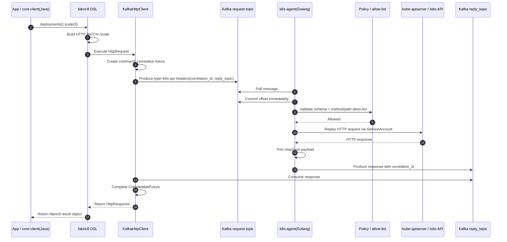
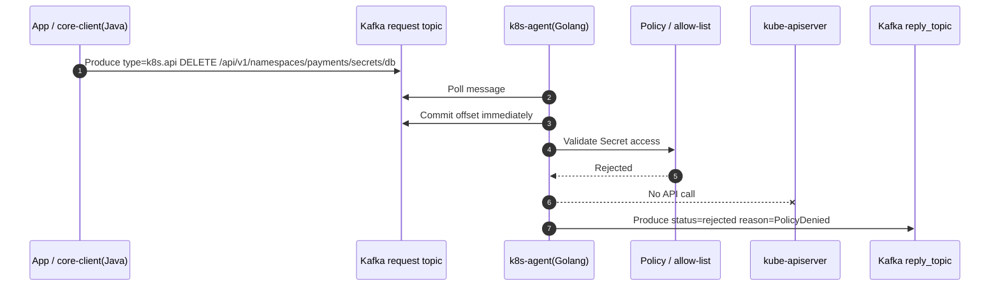
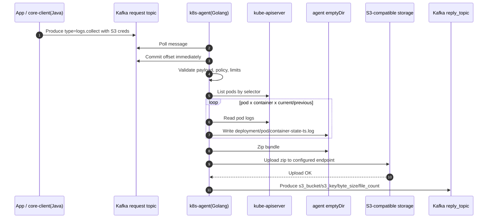
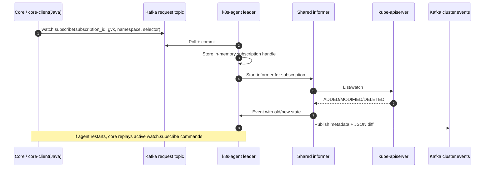
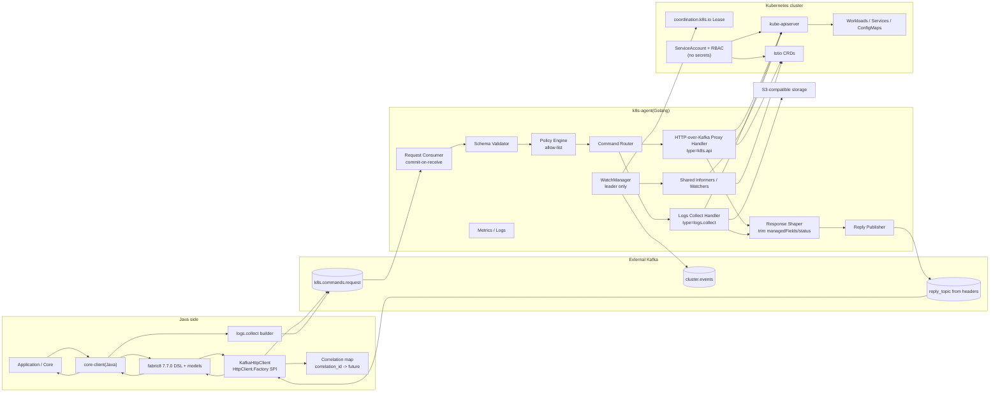
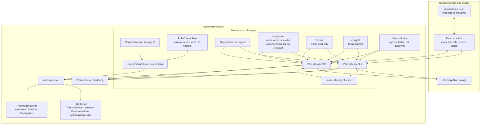

# Архитектура: core-client(Java) -- k8s-agent(Golang)

> Статус: согласованный черновик, синхронизированный с `mvp-plan.md`, `k8s-agent-architecture-nup.md`, `java-client-design.md` и `java-client-transport-options.md`.

## 1. Назначение

Связка `core-client(Java)` -- `k8s-agent(Golang)` даёт приложениям fabric8-подобный доступ к Kubernetes/Istio через Kafka, без прямого доступа Java-приложения к kube-apiserver и без Kubernetes credentials на стороне приложения.

Целевая модель:

- `core-client(Java)` предоставляет Java API в стиле fabric8.
- Generic Kubernetes/Istio операции идут через HTTP-туннель поверх Kafka: fabric8 строит обычный HTTP-запрос к kube-apiserver, а Kafka-транспорт доставляет его in-cluster агенту.
- Высокоуровневые задания, которые не являются одним kube-API вызовом, идут как типизированные команды. Первый такой сценарий -- `logs.collect`: собрать логи, упаковать zip, загрузить в S3 и вернуть ключ объекта.
- `k8s-agent(Golang)` живёт внутри одного Kubernetes-кластера, исполняет запросы своим `ServiceAccount`, применяет allow-list и публикует ответы/события обратно в Kafka.
- Агент не хранит долгоживущее состояние: история команд, retry/dedupe по `idempotency_key` и активные watch-подписки находятся на стороне core. При рестарте агента core переотправляет активные `watch.subscribe`.

## 2. Источники решений

Этот документ уточняет и сводит решения из следующих документов:

- [`mvp-plan.md`](./mvp-plan.md) -- MVP scope, Kafka request/reply, commit-on-receive, no Secrets, `logs.collect`, S3.
- [`k8s-agent-architecture-nup.md`](./k8s-agent-architecture-nup.md) -- модель agent + core, watch manager, file pipeline, deployment.
- [`java-client-design.md`](./java-client-design.md) -- fabric8-style Java client и гибрид HTTP-туннель + typed commands.
- [`java-client-transport-options.md`](./java-client-transport-options.md) -- подробности HTTP-over-Kafka транспорта.

Если документы расходятся, приоритет для MVP имеют решения из `mvp-plan.md` и `java-client-design.md`.

## 3. Роли компонентов

### core-client(Java)

Ответственность:

- предоставляет разработчику fabric8-подобный API поверх Kafka;
- использует fabric8 `7.7.0`: модели, builders, сериализацию и `HttpClient.Factory` SPI;
- подменяет сетевой transport fabric8 на `KafkaHttpClient`;
- формирует Kafka request с `correlation_id` и `reply_topic` в headers;
- держит in-memory correlation map `correlation_id -> CompletableFuture`;
- читает reply topic и завершает ожидающий future;
- управляет timeout/retry на стороне приложения/core;
- формирует `idempotency_key` для безопасного повторного вызова;
- хранит историю команд, dedupe-состояние и активные watch-подписки;
- для `logs.collect` предоставляет отдельный typed builder, не fabric8 HTTP-туннель.

`core-client` не имеет kubeconfig, ServiceAccount token или прямого сетевого доступа к kube-apiserver.

### Kafka

Ответственность:

- связывает Java side и in-cluster agent через request/reply pattern;
- передаёт `correlation_id` и `reply_topic` в headers Kafka-записи;
- хранит request/response/event потоки;
- даёт буфер между внешней системой и кластером.

Рекомендуемые топики MVP:

| Топик | Направление | Назначение |
| --- | --- | --- |
| `k8s.commands.request` | core-client -> agent | Request topic для команд |
| `reply_topic` из Kafka header | agent -> core-client | Response topic конкретного приложения/инстанса |
| `cluster.events` | agent -> core-client | События watcher-потока |

Настройки и ограничения:

- `max.message.bytes` для request/response топиков: 10 MB;
- `correlation_id` и `reply_topic` передаются в Kafka headers, не в body;
- agent commit-ит offset сразу после получения сообщения;
- семантика исполнения MVP -- at-most-once: если агент упал после commit и до ответа, команда автоматически не переисполняется;
- повтор команды инициирует core-client/core по timeout;
- DLQ в MVP не вводится, чтобы не усложнять commit/dual-write модель. Его можно добавить позже для poison-message анализа.

### k8s-agent(Golang)

Ответственность:

- читает request topic через `segmentio/kafka-go`;
- сразу commit-ит offset после получения сообщения;
- валидирует versioned JSON envelope;
- применяет allow-list до обращения к kube-apiserver;
- маршрутизирует `type=k8s.api` в HTTP-over-Kafka proxy handler;
- маршрутизирует typed commands вроде `logs.collect` в отдельные handlers;
- выполняет HTTP-запросы к kube-apiserver/Istio API через in-cluster config и ServiceAccount;
- усекает ответы перед публикацией в Kafka;
- публикует response в `reply_topic` из headers;
- запускает watcher/informer контур только на leader pod;
- публикует watcher-события в `cluster.events`;
- не читает, не пишет, не наблюдает и не публикует `Secret`.

### Kubernetes API / Istio API

Ответственность:

- применяет Kubernetes/Istio изменения от имени ServiceAccount агента;
- ограничивает агент через RBAC;
- отдаёт state/events через list/watch;
- хранит реальные ресурсы кластера.

MVP resource scope:

- Kubernetes workloads/services/configmaps;
- `Secret` полностью исключены;
- Istio CRD: `VirtualService`, `DestinationRule`, `Gateway`, `AuthorizationPolicy` по `mvp-plan.md`. В `k8s-agent-architecture-nup.md` Phase 1 перечисляет первые три CRD; `AuthorizationPolicy` включён как расширенный MVP scope из более позднего плана.

## 4. Выбранная модель реализации

Выбран гибрид:

1. **Generic CRUD/apply/patch/delete/get/list** -- HTTP-туннель поверх Kafka.
   - Java fabric8 DSL остаётся настоящим fabric8 DSL.
   - Меняется только transport через `HttpClient.Factory`.
   - Агент выступает фильтрующим Kafka-fronted reverse proxy к kube-apiserver.
2. **Высокоуровневые задания** -- typed commands.
   - `logs.collect` не выражается одним kube-API HTTP-вызовом.
   - Агент выполняет fan-out по pod/container/current/previous, zip, S3 upload и возвращает `bucket/key`.
3. **Watcher/informer поток** -- отдельный контур.
   - WatchManager работает только на leader.
   - Подписки хранятся в core; агент держит in-memory handles.
   - При рестарте агента core переотправляет `watch.subscribe`.

Ключевые решения:

- Golang агент;
- Java client на базе fabric8 `7.7.0`;
- `segmentio/kafka-go` на стороне агента;
- `org.apache.kafka:kafka-clients` на стороне Java;
- versioned JSON envelope;
- Kafka headers для `correlation_id` и `reply_topic`;
- commit-on-receive и at-most-once execution в MVP;
- `ServiceAccount` + RBAC как жёсткая граница доступа;
- allow-list как defense-in-depth;
- response shaping/trimming на агенте;
- S3 endpoint в конфиге агента;
- S3 credentials для `logs.collect` передаются в запросе;
- presigned URL не используется;
- watcher/informer контур без `Secret`;
- leader election через `coordination.k8s.io/Lease`;
- CRD для команд в MVP не вводим.

## 5. Контракт Kafka request

### 5.1. Headers

```text
correlation_id = <uuid>
reply_topic = <application-or-instance-response-topic>
```

Headers используются для request/reply routing. Агент обязан отвечать именно в `reply_topic` из headers и вернуть тот же `correlation_id`.

### 5.2. Body для generic kube/Istio операции

Generic операции идут как `type=k8s.api`: body содержит HTTP-запрос, который fabric8 уже построил для kube-apiserver.

```json
{
  "schema_version": "v1",
  "command_id": "cmd-01J...",
  "type": "k8s.api",
  "issuer": "core-client",
  "idempotency_key": "payments/apps/v1/deployments/api/scale/3",
  "timeout": "30s",
  "issued_at": "2026-06-29T21:26:00Z",
  "http": {
    "method": "PATCH",
    "path": "/apis/apps/v1/namespaces/payments/deployments/api/scale",
    "headers": {
      "Content-Type": "application/merge-patch+json"
    },
    "body": "{\"spec\":{\"replicas\":3}}"
  }
}
```

Перед проксированием агент разбирает `method/path`, вычисляет verb/resource/GVK/namespace/name и проверяет их против allow-list.

### 5.3. Body для typed command `logs.collect`

```json
{
  "schema_version": "v1",
  "command_id": "cmd-01J...",
  "type": "logs.collect",
  "issuer": "core-client",
  "idempotency_key": "logs/payments/app-api/2026-06-29T21",
  "timeout": "10m",
  "issued_at": "2026-06-29T21:26:00Z",
  "payload": {
    "namespace": "payments",
    "label_selector": "app=api",
    "containers": "all",
    "include_current": true,
    "include_previous": true,
    "since_time": "2026-06-29T20:26:00Z",
    "tail_lines": 10000,
    "limit_bytes": 104857600,
    "s3": {
      "bucket": "logs-bundles",
      "key": "logs/2026/06/29/cmd-01J.zip",
      "access_key_id": "<short-lived>",
      "secret_access_key": "<short-lived>"
    }
  }
}
```

S3 endpoint и region берутся из конфига агента. В ответе агент возвращает bucket/key, а не presigned URL.

## 6. Контракт Kafka response

Ответ публикуется в `reply_topic` из request headers.

```json
{
  "schema_version": "v1",
  "command_id": "cmd-01J...",
  "correlation_id": "corr-01J...",
  "status": "completed",
  "reason": "Applied",
  "resource_ref": {
    "group": "apps",
    "version": "v1",
    "kind": "Deployment",
    "namespace": "payments",
    "name": "api"
  },
  "resource_version": "123456",
  "started_at": "2026-06-29T21:26:01Z",
  "finished_at": "2026-06-29T21:26:02Z",
  "error": null
}
```

Статусы:

| Статус | Значение |
| --- | --- |
| `completed` | команда выполнена успешно |
| `failed` | команда дошла до handler, но завершилась ошибкой |
| `rejected` | envelope/policy не прошли проверку; обращения к kube-apiserver не было |
| `executing` | промежуточный статус для long-running задач, если включён progress reporting |

Для `logs.collect` результат расширяется:

```json
{
  "schema_version": "v1",
  "command_id": "cmd-01J...",
  "correlation_id": "corr-01J...",
  "status": "completed",
  "s3_bucket": "logs-bundles",
  "s3_key": "logs/2026/06/29/cmd-01J.zip",
  "byte_size": 7340032,
  "file_count": 18,
  "partial_errors": []
}
```

## 7. Диаграммы последовательностей

### 7.1. Generic операция через fabric8 HTTP-over-Kafka



### 7.2. Отклонение запрещённой операции



### 7.3. `logs.collect`: логи -> zip -> S3 -> key



### 7.4. Watch подписка и публикация cluster.events



## 8. Диаграмма компонентов



## 9. Диаграмма развёртывания



## 10. Логическая структура k8s-agent

```text
cmd/agent/
  main.go                    // wiring, config, graceful shutdown

internal/config/
  config.go                  // env + ConfigMap parsing

internal/kafka/
  consumer.go                // request topic consumer, commit-on-receive
  producer.go                // reply_topic and cluster.events publishers

internal/command/
  envelope.go                // versioned JSON contracts
  validator.go               // schema validation
  router.go                  // type -> handler

internal/policy/
  policy.go                  // allow-list: verb x GVK x namespace + command types

internal/handlers/
  api/
    proxy.go                 // type=k8s.api HTTP-over-Kafka -> apiserver
    path_resolver.go         // method/path -> verb/GVK/resource
  logs/
    collect.go               // type=logs.collect

internal/k8s/
  client.go                  // in-cluster config, REST client, dynamic client
  mapper.go                  // discovery and RESTMapper cache
  informer.go                // shared informers/watchers
  lease.go                   // leader election

internal/watch/
  manager.go                 // in-memory subscriptions, leader-only
  events.go                  // metadata + JSON diff publisher

internal/s3/
  client.go                  // S3-compatible upload using endpoint from config

internal/result/
  publisher.go               // reply topic writer
  shaping.go                 // trim managedFields/last-applied/status

internal/observability/
  metrics.go
  logging.go
```

## 11. Безопасность

Минимальные правила:

- core-client не получает Kubernetes credentials;
- агент работает под выделенным ServiceAccount;
- RBAC не включает доступ к `secrets`;
- агент полностью исключает `Secret` из read/write/watch/log/result потоков;
- операции проходят allow-list до обращения к kube-apiserver;
- allow-list покрывает command type, verb, GVK/resource и namespace;
- Kafka использует TLS + SASL/SCRAM или mTLS;
- Kafka ACL ограничивают: core-client пишет request и читает свои reply topics; агент читает request и пишет reply/events;
- NetworkPolicy разрешает агенту egress только к kube-apiserver, Kafka и S3 endpoint;
- S3 credentials из `logs.collect` не логируются и должны быть короткоживущими;
- presigned URL не используется, потому что egress добавляет headers и ломает подпись.

### 11.1. Что значит "уменьшается blast radius core-client"

Blast radius -- это максимальный ущерб от компрометации компонента. Когда core-client не имеет kubeconfig, ServiceAccount token и прямого сетевого доступа к kube-apiserver, компрометация Java-приложения не превращается автоматически в компрометацию Kubernetes API.

Практически это означает:

1. **Нет прямых Kubernetes credentials на стороне Java.** Злоумышленник не может забрать kubeconfig/token из core-client и использовать его вне штатного Kafka-канала.
2. **Нет прямого Kubernetes API канала.** Даже если приложение скомпрометировано, оно может только публиковать Kafka request, а не произвольно ходить в kube-apiserver.
3. **Команды проходят через фильтрующий агент.** Агент проверяет allow-list до обращения к API. Например, запрос к `Secret` будет отклонён, даже если core-client попробует его отправить.
4. **RBAC агента остаётся последней границей.** Если ошибка в allow-list пропустит лишний запрос, kube-apiserver всё равно применит права ServiceAccount агента.
5. **Один агент = один кластер.** Компрометация клиента, который работает с одним request topic/агентом, не даёт автоматический доступ к другим кластерам с другими агентами и ServiceAccount.
6. **Сужается аудит.** Все Kubernetes действия проходят через агент: `command_id`, `issuer`, `correlation_id`, Kafka offset и результат можно логировать централизованно.

То есть core-client становится не "носителем cluster-admin credentials", а ограниченным Kafka producer/consumer. Его возможный ущерб ограничен Kafka ACL, allow-list агента и RBAC ServiceAccount агента.

## 12. Почему будущий reconcile можно добавить без изменения Kafka-контракта

Фраза "архитектура допускает добавление reconcile-контроллеров без изменения Kafka-контракта" означает, что Kafka envelope описывает внешний intent и routing metadata, но не фиксирует внутренний способ исполнения внутри агента.

Сейчас execution path для `type=k8s.api` выглядит так:

```text
Kafka request -> validator -> policy -> router -> direct proxy handler -> kube-apiserver -> reply
```

Позже для части команд можно заменить direct handler на adapter к reconcile-контуру:

```text
Kafka request -> validator -> policy -> router -> desired-state adapter -> workqueue/reconciler -> kube-apiserver -> reply/events
```

Kafka-контракт при этом остаётся тем же:

- headers: `correlation_id`, `reply_topic`;
- body: `schema_version`, `command_id`, `type`, `idempotency_key`, `timeout`, `issued_at`, payload/http;
- result: `command_id`, `correlation_id`, `status`, `reason`, timestamps, error/details.

Меняется только внутренняя реализация handler-а:

- direct handler сразу делает HTTP/proxy/apply;
- reconcile handler может материализовать intent во внутреннюю workqueue, in-memory desired state или, если позже будет принято отдельное решение, в CRD;
- watcher/informer уже есть, поэтому reconciler может переиспользовать cache, event handlers, RESTMapper и Kubernetes clients;
- для долгих операций result stream может использовать уже существующие статусы `executing`/`completed`/`failed`, не добавляя новый Kafka protocol.

Это важно для эволюции: MVP остаётся простым command executor, но ресурсы, где нужно удерживать desired state, можно перевести на reconcile-поведение без миграции Java-клиента и без смены request/reply топиков.

## 13. Надёжность и семантика доставки

MVP сознательно выбирает простую модель:

- агент commit-ит Kafka offset сразу после получения сообщения;
- затем выполняет команду и публикует response;
- если агент падает после commit, Kafka не переотправляет сообщение;
- core-client/core ждёт response до timeout;
- при timeout core-client/core решает, повторять ли команду;
- для безопасного повтора используется `idempotency_key`, server-side apply и идемпотентные payload-ы там, где это возможно.

Почему не DLQ/transactional outbox в MVP:

- DLQ полезен для at-least-once модели, где сообщение удерживается до успешного результата или terminal failure;
- выбранная MVP-модель commit-on-receive не блокирует consumer poison-сообщением;
- rejected/failed результат уходит в reply topic;
- если потребуется строгая гарантия "принято -> обязательно будет результат", нужно отдельно вводить outbox/state storage или менять commit policy.

## 14. Идемпотентность

В MVP агент остаётся stateless, поэтому главный владелец идемпотентности -- core/core-client. Агент не хранит долгоживущее состояние обработанных `idempotency_key`, не держит persistent outbox и не использует Redis/PostgreSQL/CRD для dedupe.

Идемпотентность обеспечивается слоями:

1. core генерирует стабильный `idempotency_key`;
2. core хранит состояние операции по `idempotency_key`;
3. core принимает решение о retry после timeout или ошибки;
4. команды проектируются как "привести к состоянию", а не "сделать относительное изменение";
5. Kubernetes handlers используют идемпотентные паттерны там, где это возможно.

### 14.1. Ответственность core

Core хранит состояние команды примерно в такой модели:

```text
idempotency_key -> command_id, status, result, created_at, updated_at
```

Поведение core:

- если по `idempotency_key` уже есть `completed`, core возвращает сохранённый result и не создаёт новую бизнес-операцию;
- если операция ещё `executing`, core возвращает текущий статус или продолжает ждать response;
- если операция завершилась `failed`, core решает, разрешён ли retry для данного типа команды;
- если response не пришёл до timeout, core может повторно отправить тот же intent с тем же `idempotency_key`;
- если пользователь повторяет тот же запрос, core должен переиспользовать существующий `idempotency_key`, а не создавать новый.

Это особенно важно из-за выбранной Kafka-семантики MVP: агент commit-ит offset при получении, поэтому Kafka не переисполнит команду автоматически после падения агента. Повтор инициируется снаружи -- core/client-слоем.

### 14.2. Правила проектирования команд

Команды должны описывать конечное желаемое состояние.

Хороший пример:

```json
{
  "type": "workload.scale",
  "payload": {
    "replicas": 3
  }
}
```

Повтор такой команды безопасен: workload снова будет приведён к `replicas=3`.

Плохой пример:

```json
{
  "type": "workload.scale",
  "payload": {
    "increment": 1
  }
}
```

Повтор такой команды меняет состояние повторно и не является идемпотентным.

### 14.3. Kubernetes/Istio операции

| Операция | Идемпотентный паттерн |
| --- | --- |
| `GET` / `LIST` | Уже идемпотентны. |
| `apply` | Server-side apply со стабильным `fieldManager`. |
| `scale` | Только абсолютное значение `replicas`, без `increment/decrement`. |
| `delete` | `404 NotFound` трактуется как успешное конечное состояние "ресурса нет". |
| `create` | В MVP предпочтительно заменить на `apply`; если нужен `create`, использовать фиксированное имя и явно обрабатывать `AlreadyExists`. |
| `patch` | Разрешать только паттерны, где повтор не меняет состояние повторно; с осторожностью относиться к JSON Patch `add` в массивы. |
| Istio CRD изменения | Использовать apply/patch с теми же правилами, что для Kubernetes ресурсов. |

Для generic HTTP-туннеля агент не всегда знает бизнес-смысл операции, поэтому основная защита находится в allow-list и в том, какие fabric8 операции core-client предоставляет наружу. Например, клиентский API не должен поощрять относительные изменения вроде "увеличить replicas на 1".

### 14.4. `logs.collect`

`logs.collect` -- long-running typed command:

```text
read logs -> temp files -> zip -> S3 upload -> response with bucket/key
```

Для идемпотентности:

- core использует стабильный `idempotency_key`;
- S3 key должен быть детерминированным, например `logs/<yyyy>/<mm>/<dd>/<idempotency_key>.zip`;
- если core уже видел успешный result, повторный пользовательский запрос возвращает сохранённый `s3_bucket/s3_key`;
- если response потерян и core инициирует retry, агент может заново собрать bundle и записать его в тот же key;
- S3 credentials из запроса должны быть короткоживущими, а key не должен зависеть от случайного значения агента.

Для MVP допустима простая модель: retry `logs.collect` повторно собирает zip и перезаписывает тот же S3 object key. Если позже потребуется более строгая гарантия, можно перейти на temp key + finalize/copy в final key или conditional write, если выбранный S3 provider это поддерживает.

### 14.5. Что агент в MVP не гарантирует

Агент в MVP не обеспечивает exactly-once и не делает persistent dedupe.

Он не хранит:

- историю команд;
- множество уже обработанных `idempotency_key`;
- persistent locks;
- transactional outbox;
- CRD/Redis/PostgreSQL состояние исполнения.

Если core отправит две одинаковые команды одновременно, агент может выполнить обе. Это должно предотвращаться core-side lock/dedupe по `idempotency_key`.

### 14.6. Возможное усиление после MVP

Если появится требование "принято агентом -> результат гарантированно будет опубликован" или "агент сам подавляет дубли после рестарта", возможны варианты усиления:

1. core-side distributed lock по `idempotency_key` -- предпочтительный путь для текущей модели agent + core;
2. agent-side in-memory in-flight cache -- защищает только от дублей внутри одного живого pod;
3. persistent state/outbox/CRD -- даёт более строгие гарантии, но делает агент stateful и усложняет MVP;
4. изменение Kafka commit policy -- commit после публикации result или DLQ, что меняет семантику с at-most-once на at-least-once и требует более сильной идемпотентности handlers.

Для MVP выбран вариант: **core idempotency store + идемпотентный дизайн команд + deterministic S3 keys**.

## 15. Response shaping

Агент не является полностью прозрачным proxy: он фильтрует запросы и формирует ответы так, чтобы не перегружать Kafka.

По умолчанию из ответов удаляются:

- `metadata.managedFields`;
- `kubectl.kubernetes.io/last-applied-configuration`.

Опционально по конфигу:

- `status`;
- другие тяжёлые поля, не нужные клиенту.

Сохраняются поля, важные для клиента и optimistic concurrency:

- `metadata.uid`;
- `metadata.resourceVersion`;
- `metadata.generation`;
- `status.observedGeneration`, если status не вырезается.

Для `LIST` используется пагинация Kubernetes API. Для producer-а включается compression (`zstd`/`lz4`).

## 16. Наблюдаемость

Метрики:

- `k8s_agent_commands_total{type,status}`;
- `k8s_agent_command_duration_seconds{type}`;
- `k8s_agent_kafka_lag`;
- `k8s_agent_kube_api_errors_total{code,resource}`;
- `k8s_agent_informer_sync_status{resource}`;
- `k8s_agent_watch_subscriptions_active`;
- `k8s_agent_file_upload_bytes_total`;
- `k8s_agent_response_trimmed_bytes_total`.

Логи:

- `command_id`;
- `correlation_id`;
- `idempotency_key`;
- `command_type`;
- `issuer`;
- `method`;
- `path`;
- `target`;
- `status`;
- `reason`;
- `kafka_partition`;
- `kafka_offset`.

Секретные значения, включая S3 credentials из `logs.collect`, не пишутся в логи.

## 17. Открытые вопросы

1. Нужен ли криптографический signature/HMAC поверх Kafka ACL?
2. Нужна ли строгая гарантия результата для каждой принятой команды? Если да, потребуется outbox/state storage или другая commit policy.
3. Нужен ли двухфазный `accepted -> completed` ответ для `logs.collect` уже в MVP?
4. Какие exact namespaces входят в allow-list первой поставки?
5. Нужно ли включать `AuthorizationPolicy` в Phase 1 вместе с `VirtualService`, `DestinationRule`, `Gateway`, или оставить её в расширенном MVP scope?
