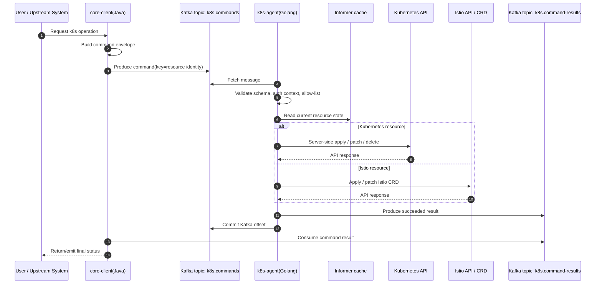
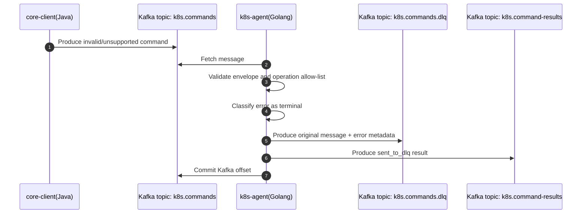
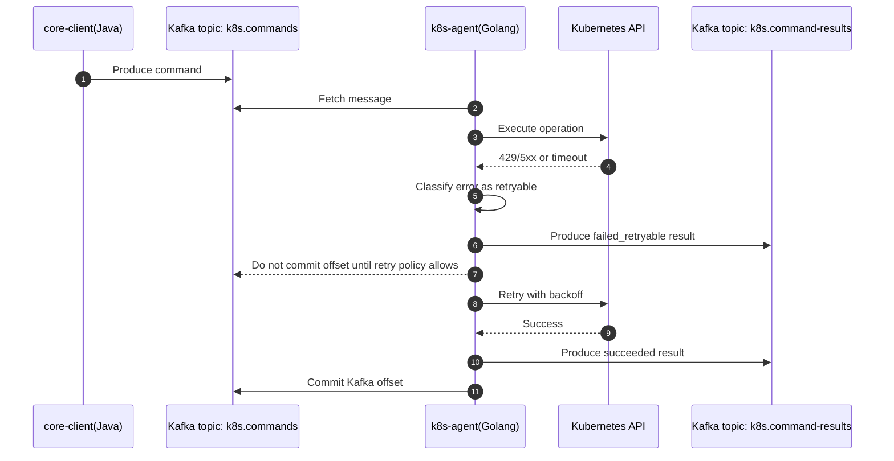
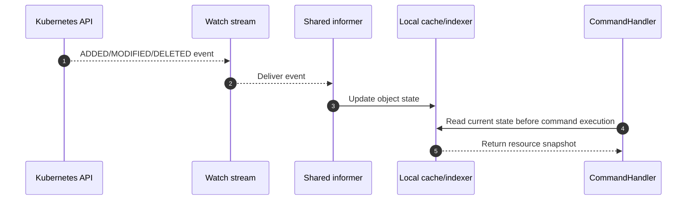
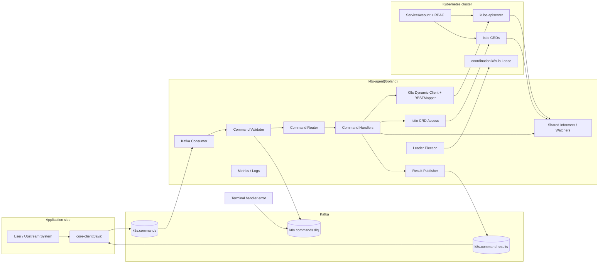
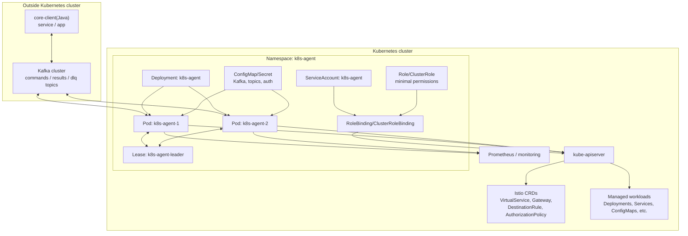

# Архитектура: core-client(Java) -- k8s-agent(Golang)

> Статус: черновик архитектуры для обсуждения. Основано на выбранном гибридном варианте: Kafka-driven command executor + возможность развития в controller/reconcile-модель.

## 1. Назначение

Связка `core-client(Java)` -- `k8s-agent(Golang)` нужна для безопасного выполнения команд в Kubernetes-кластере через асинхронный Kafka-контур.

`core-client` формирует команды бизнес-уровня и публикует их в Kafka. `k8s-agent` развёрнут внутри Kubernetes-кластера, читает команды из Kafka, валидирует их, выполняет через Kubernetes API / Istio API и публикует результат обработки обратно в Kafka.

## 2. Роли компонентов

### core-client(Java)

Ответственность:

- формирует команды в согласованном формате;
- назначает `command_id`, `idempotency_key`, `issued_by`;
- выбирает Kafka key для упорядочивания команд по ресурсу;
- публикует команды в топик команд;
- читает топик результатов;
- сопоставляет результат с исходной командой;
- отображает статус пользователю или вышестоящей системе.

core-client не ходит напрямую в kube-apiserver. Это упрощает сетевую модель и позволяет держать Kubernetes RBAC только на стороне агента.

### Kafka

Ответственность:

- буферизует команды;
- обеспечивает at-least-once доставку;
- упорядочивает сообщения внутри партиции;
- разделяет контуры команд, результатов и DLQ.

Рекомендуемые топики:

| Топик | Назначение |
| --- | --- |
| `k8s.commands` | входящие команды от core-client |
| `k8s.command-results` | результаты выполнения команд |
| `k8s.commands.dlq` | сообщения, которые нельзя корректно обработать |

### k8s-agent(Golang)

Ответственность:

- читает команды из Kafka consumer group;
- валидирует envelope и payload;
- проверяет allow-list операций;
- выполняет команды через Kubernetes API / Istio API;
- использует informers/watchers как кэш состояния и источник событий;
- публикует результат в Kafka;
- пишет метрики и структурированные логи;
- использует leader election для операций, которые не должны выполняться параллельно несколькими репликами.

### Kubernetes API / Istio API

Ответственность:

- применяет изменения к Kubernetes-ресурсам и Istio CRD;
- отдаёт состояние ресурсов агенту через list/watch;
- ограничивает доступ агента через ServiceAccount и RBAC.

## 3. Выбранная модель реализации

Выбран гибридный вариант:

1. Базовый режим -- императивное выполнение команд из Kafka:
   - `apply`;
   - `patch`;
   - `delete`;
   - `scale`;
   - операции над Istio CRD.
2. Архитектура агента сразу отделяет Kafka-слой от слоя исполнения через `CommandHandler`.
3. Для ресурсов, где позже потребуется поддерживать желаемое состояние, можно добавить reconcile-контроллеры без переписывания Kafka-интеграции.

Ключевые решения:

- Golang агент;
- `segmentio/kafka-go` как Kafka-клиент;
- `client-go` dynamic client + RESTMapper для Kubernetes/Istio ресурсов;
- JSON envelope для первой версии контракта;
- server-side apply для идемпотентных изменений;
- Kafka DLQ для невалидных/ядовитых сообщений;
- result topic для обратной связи;
- Kubernetes ServiceAccount + RBAC;
- leader election через `coordination.k8s.io/Lease`;
- informers/watchers для кэша состояния и событий.

## 4. Контракт команды

Черновая структура сообщения:

```json
{
  "command_id": "cmd-01J...",
  "idempotency_key": "cluster-a/default/deployment/apply/my-app",
  "type": "k8s.apply",
  "issued_by": "core-client",
  "ts": "2026-06-29T21:26:00Z",
  "dry_run": false,
  "target": {
    "group": "apps",
    "version": "v1",
    "kind": "Deployment",
    "namespace": "default",
    "name": "my-app"
  },
  "payload": {
    "manifest": {}
  }
}
```

Рекомендуемый Kafka key:

```text
<cluster>/<namespace>/<group>/<kind>/<name>
```

Так команды по одному ресурсу попадают в одну партицию и сохраняют порядок обработки внутри неё.

## 5. Контракт результата

Черновая структура результата:

```json
{
  "command_id": "cmd-01J...",
  "idempotency_key": "cluster-a/default/deployment/apply/my-app",
  "status": "succeeded",
  "reason": "Applied",
  "message": "Deployment default/my-app applied",
  "observed_generation": 7,
  "resource_version": "123456",
  "started_at": "2026-06-29T21:26:01Z",
  "finished_at": "2026-06-29T21:26:02Z"
}
```

Статусы:

| Статус | Значение |
| --- | --- |
| `accepted` | агент принял команду в обработку |
| `succeeded` | команда успешно выполнена |
| `failed_retryable` | ошибка временная, допустим повтор |
| `failed_terminal` | ошибка постоянная, повтор не поможет |
| `sent_to_dlq` | сообщение отправлено в DLQ |

## 6. Диаграммы последовательностей

### 6.1. Успешное выполнение команды



### 6.2. Ошибка валидации и отправка в DLQ



### 6.3. Обработка временной ошибки Kubernetes API



### 6.4. Watcher/informer обновляет локальный кэш



## 7. Диаграмма компонентов



## 8. Диаграмма развёртывания



## 9. Логическая структура k8s-agent

```text
cmd/agent/
  main.go                  // wiring, config, signal handling

internal/config/
  config.go                // env/config parsing

internal/kafka/
  consumer.go              // command topic consumer
  producer.go              // result and dlq producers
  retry.go                 // retry/backoff policy

internal/command/
  envelope.go              // command/result contracts
  validator.go             // schema and semantic validation
  router.go                // command type -> handler

internal/handlers/
  apply.go                 // server-side apply
  patch.go                 // json/merge patch
  delete.go                // delete with safety checks
  scale.go                 // scale subresource
  istio.go                 // Istio CRD operations

internal/k8s/
  client.go                // in-cluster config, dynamic client
  mapper.go                // RESTMapper and discovery
  informer.go              // shared informers/watchers
  lease.go                 // leader election

internal/result/
  publisher.go             // result topic writer

internal/observability/
  metrics.go
  logging.go
```

## 10. Безопасность

Минимальный набор правил:

- core-client не получает Kubernetes credentials;
- агент работает под выделенным ServiceAccount;
- RBAC задаётся явно по группам ресурсов и verbs;
- команды проходят allow-list;
- опасные операции (`delete`, `scale-to-zero`, изменение Istio Gateway/AuthorizationPolicy) требуют отдельной политики;
- Kafka ACL ограничивают producer/consumer права;
- при необходимости добавляется подпись сообщения или HMAC/JWS на envelope;
- DLQ не должен содержать секреты из payload.

## 11. Наблюдаемость

Метрики:

- `k8s_agent_commands_total{type,status}`;
- `k8s_agent_command_duration_seconds{type}`;
- `k8s_agent_kafka_lag`;
- `k8s_agent_dlq_total{reason}`;
- `k8s_agent_kube_api_errors_total{code,resource}`;
- `k8s_agent_informer_sync_status{resource}`.

Логи:

- `command_id`;
- `idempotency_key`;
- `command_type`;
- `target`;
- `status`;
- `reason`;
- `kafka_partition`;
- `kafka_offset`.

## 12. Открытые вопросы

1. Нужен ли allow-list только на уровне `type` или также на уровне namespace/resource/name?
2. Нужна ли подпись команд помимо Kafka ACL?
3. Нужно ли хранить историю команд в отдельном storage или достаточно Kafka + логов?
4. Нужны ли собственные CRD для долгоживущих desired-state операций?
5. Какие Istio API входят в первую версию: `VirtualService`, `Gateway`, `DestinationRule`, `AuthorizationPolicy`?
