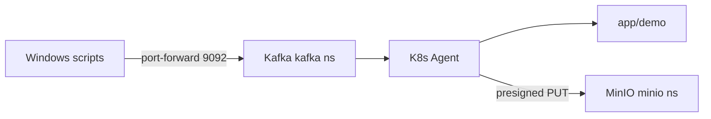

# Локальное dev-окружение: minikube + Kafka + MinIO

Полный стек для пробы [k8s-agent](../k8s-agent/) на Windows.

## Требования

| Компонент | Назначение |
|---|---|
| Go 1.22+ | сборка агента и утилит |
| Docker Desktop | driver minikube |
| minikube | локальный Kubernetes |
| kubectl | CLI кластера |
| Helm 3 | Kafka и MinIO |

## Быстрый старт

```powershell
cd k:\Project\agent
.\scripts\dev\setup.ps1
```

Скрипт выполняет:

1. `minikube start` (4 CPU, 8 GB RAM)
2. Helm: Kafka (namespace `kafka`) + MinIO (namespace `minio`)
3. Создание топиков: `commands.in`, `commands.results`, `cluster.events`, `commands.dlq`
4. `go mod tidy`, `go test`, сборка `bin/k8s-agent.exe`, `presign.exe`, `kafka-probe.exe`
5. Docker build `k8s-agent:dev` внутри minikube
6. Deploy агента + demo workload в namespace `app`

## Пробы

### resource.list

```powershell
.\scripts\dev\probe-resource-list.ps1
```

Отправляет JSON из `scripts/dev/payloads/resource-list.json` в `commands.in`, читает ответ из `commands.results`.

### file.fetch (export Pods → MinIO)

```powershell
.\scripts\dev\probe-file-fetch.ps1
```

Генерирует presigned PUT URL (in-cluster host `minio.minio.svc.cluster.local:9000`), отправляет `file.fetch` с `source=resource_export`.

## Архитектура



## Адреса in-cluster

| Сервис | DNS |
|---|---|
| Kafka | `kafka.kafka.svc.cluster.local:9092` |
| MinIO | `minio.minio.svc.cluster.local:9000` |
| Agent | `k8s-agent.k8s-agent.svc.cluster.local:8080` |

Dev-overlay: [k8s-agent/deploy/dev/agent-dev.yaml](../k8s-agent/deploy/dev/agent-dev.yaml) — 1 replica, `imagePullPolicy: Never`, образ `k8s-agent:dev`.

## Утилиты

### presign

```powershell
k8s-agent\bin\presign.exe `
  -endpoint minio.minio.svc.cluster.local:9000 `
  -bucket exports `
  -object test/object.tar.gz
```

### kafka-probe

```powershell
# port-forward Kafka first
kubectl port-forward -n kafka svc/kafka 9092:9092

k8s-agent\bin\kafka-probe.exe -action send -topic commands.in -file scripts\dev\payloads\resource-list.json
k8s-agent\bin\kafka-probe.exe -action consume -topic commands.results -from-beginning -timeout 30s
```

## Troubleshooting

### Agent CrashLoopBackOff

```powershell
kubectl logs -n k8s-agent deployment/k8s-agent
kubectl describe pod -n k8s-agent -l app=k8s-agent
```

Частые причины:

- **KAFKA_BROKERS** — должен быть `kafka.kafka.svc.cluster.local:9092`, не `kafka:9092`
- Kafka ещё не ready — дождаться `kubectl wait` в setup.ps1

### Команда отправлена, но нет ответа

```powershell
kubectl logs -n k8s-agent deployment/k8s-agent -f
kubectl exec -n kafka <kafka-pod> -- kafka-consumer-groups.sh --bootstrap-server localhost:9092 --describe --group k8s-agent
```

- Убедиться, что топик `commands.in` существует
- Проверить `issued_by: core-prod` и namespace в policy ConfigMap

### presigned PUT 403 / PRESIGNED_URL_EXPIRED

- Presigned URL должен генерироваться с тем же host, что видит агент (`minio.minio.svc.cluster.local:9000`)
- Не менять host в URL после подписи
- Увеличить `-expiry` в presign

### file.fetch failed: LIST_FAILED

- RBAC: `kubectl auth can-i list pods --as=system:serviceaccount:k8s-agent:k8s-agent -n app`
- Namespace `app` должен быть в policy `allowed_namespaces`

### MinIO: проверить объект

```powershell
kubectl port-forward -n minio svc/minio 9000:9000
# Browser: http://localhost:9000 (minioadmin / minioadmin)
```

## Пересборка агента после изменений кода

```powershell
cd k:\Project\agent\k8s-agent
go test ./...
minikube docker-env | Invoke-Expression
docker build -t k8s-agent:dev .
kubectl rollout restart deployment/k8s-agent -n k8s-agent
kubectl rollout status deployment/k8s-agent -n k8s-agent
```

## Teardown

```powershell
helm uninstall kafka -n kafka
helm uninstall minio -n minio
kubectl delete namespace k8s-agent app kafka minio --ignore-not-found
minikube stop
```
