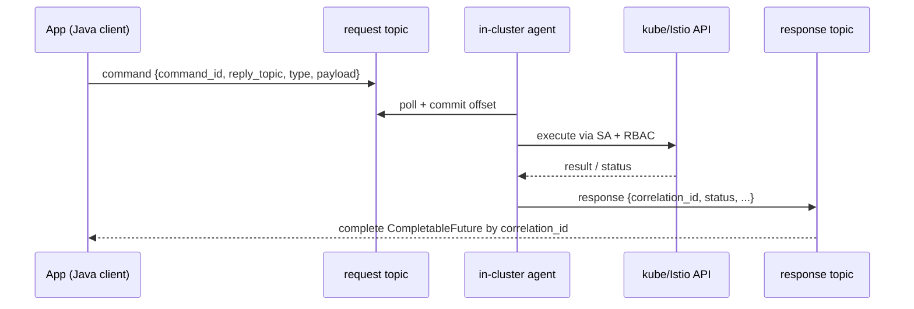

# Драфт: Java-клиент к kube-api через Kafka (fabric8-style)

> Статус: черновик для обсуждения. Кода пока нет — фиксируем архитектуру клиента.
> Связанные документы: [design-draft.md](design-draft.md), [mvp-plan.md](mvp-plan.md).

## Задача

Библиотека на стороне приложения, которая даёт разработчику привычный fabric8-подобный API
(`KubernetesClient`/`IstioClient`), но **транспорт идёт не по HTTP к kube-apiserver, а через Kafka**
(request/response топики) до in-cluster агента. Агент уже исполняет операции своим
`ServiceAccount` + `RBAC`. У приложения **нет** kube-credentials — только доступ к Kafka.

Граница безопасности — `ServiceAccount` агента + `RBAC` (см. [mvp-plan.md](mvp-plan.md)).
Это намеренно делает агента шлюзом «доступ к kube-api по Kafka», ограниченным правами SA.

## Что взять из fabric8 (рекомендация)

Проверено на fabric8 kubernetes-client 7.7.0 (середина 2026):

| Компонент fabric8 | Берём? | Зачем / комментарий |
| --- | --- | --- |
| Модель ресурсов (`io.fabric8:kubernetes-client-api`, POJO `Pod`, `Deployment`, `Service`, `ConfigMap`, builders) | **Да** | Не переписываем POJO/билдеры руками; берём готовые типизированные модели и fluent-builders. |
| Istio-модель и DSL (`io.fabric8:istio-model`, `io.fabric8:istio-client`) | **Да** | `VirtualService`, `DestinationRule`, `Gateway`, `AuthorizationPolicy` уже есть, включая `serverSideApply`. |
| Сериализация (`io.fabric8.kubernetes.client.utils.Serialization` / `KubernetesSerialization`, Jackson) | **Да** | Единый JSON-формат payload с агентом, без расхождений схем. |
| **Подключаемый транспорт через SPI** `io.fabric8.kubernetes.client.http.HttpClient.Factory` (регистрация через `META-INF/services`) | **Да (ключевое)** | Позволяет подменить HTTP-бэкенд на Kafka и переиспользовать **весь** DSL `KubernetesClient`/`IstioClient` поверх Kafka. |
| Сетевой слой (TLS/auth/`Config`/прокси, okhttp/vertx/jetty/jdk бэкенды) | **Нет** | Нерелевантно: kube-credentials и TLS живут на агенте, не на клиенте. Наш `Config` — заглушка (фиктивный masterUrl). |
| WebSocket-фичи (`exec`/`attach`/`port-forward`/follow-logs) | **Нет в MVP** | Стриминг по WebSocket поверх Kafka — отдельная большая задача; в MVP кидаем `UnsupportedOperationException`. |
| Informers/watch (`SharedInformer`) | **Отложить** | Требует стриминга событий; в MVP клиент — request/response. См. фазу 2. |

Вывод: переиспользуем модель + сериализацию + DSL, а **меняем только транспорт** через штатную точку расширения fabric8 (`HttpClient.Factory`). Это и есть «fabric8, но через Kafka».

## Два варианта реализации транспорта

### Вариант 1 — HTTP-туннель поверх Kafka (через `HttpClient` SPI) — рекомендуемый

Реализуем `KafkaHttpClientFactory implements io.fabric8.kubernetes.client.http.HttpClient.Factory`
и `KafkaHttpClient`, который:

1. Сериализует исходящий fabric8 `HttpRequest` (method, path+query, нужные headers, body bytes)
   в конверт команды и шлёт в **request-топик**.
2. Ждёт ответ из **response-топика** по `correlation_id` (через `CompletableFuture`).
3. Восстанавливает `HttpResponse` (status, headers, body) для fabric8.

Регистрируем фабрику в `META-INF/services/io.fabric8.kubernetes.client.http.HttpClient$Factory`.
После этого `new KubernetesClientBuilder().build()` и `istio-client` работают **поверх Kafka без изменений вызывающего кода**:

```java
KubernetesClient client = new KubernetesClientBuilder()
    .withConfig(kafkaTunnelConfig())   // фиктивный masterUrl, реальная авторизация — на агенте
    .build();

client.apps().deployments().inNamespace("payments")
    .withName("api").scale(3);          // уходит командой в Kafka, агент исполняет
```

На стороне **агента** запрос трактуется как HTTP-вызов (verb + path + body) и проксируется
в in-cluster apiserver его `ServiceAccount`. Агент по сути — обратный прокси к kube-apiserver,
фронтированный Kafka и ограниченный RBAC.

- ➕ Максимальное переиспользование fabric8: весь DSL, Istio, типы, билдеры — «бесплатно».
- ➕ Минимум собственного протокола; новые kube-API работают без правок контракта.
- ➕ Хорошо ложится на решение «доступ = SA + RBAC» (прозрачный шлюз).
- ➖ На агенте нужен слой «HTTP-over-Kafka → apiserver» (разбор path/verb, проксирование).
- ➖ Watch/streaming и WebSocket-фичи — сложные, переносим в фазу 2.
- ➖ Латентность = round-trip через Kafka на каждый вызов.

### Вариант 2 — типизированный командный DSL поверх Kafka

Свой fluent-DSL, который строит командный конверт (`type` + `target` GVK + `payload`
= сериализованная fabric8-модель) и шлёт в Kafka; ответ — наш result-конверт.

- ➕ Полный контроль над набором операций; естественно ложатся высокоуровневые задания.
- ➕ Проще на стороне агента (нет эмуляции HTTP).
- ➖ Нужно вручную воспроизводить эргономику fabric8-DSL (много работы и риск расхождений).
- ➖ Каждую новую операцию добавляем руками.

### Рекомендация

**Гибрид с упором на Вариант 1:**

- Generic CRUD/apply/patch/delete/get/(list) — через **HTTP-туннель** (Вариант 1): переиспользуем
  fabric8-DSL целиком.
- Высокоуровневые задания, которые **не являются** простым kube-API вызовом
  (в первую очередь `logs.collect` → zip → S3 → ключ), — через **отдельный типизированный командный канал**
  (Вариант 2-стиль), с собственным fluent-API в нашей библиотеке.

То есть в одном клиенте две «дорожки» поверх тех же request/response топиков:
`type=k8s.api` (туннель) и `type=logs.collect` / будущие задания (типизированные команды).

## Протокол request/reply поверх Kafka

- Топики: `k8s.commands.request`, `k8s.commands.response`; `max.message.bytes = 10 МБ`.
- Заголовки/конверт (согласованы с [mvp-plan.md](mvp-plan.md)):
  `schema_version`, `command_id`, `correlation_id`, `reply_topic`, `type`, `issuer` (аудит), `target`,
  `payload`, `idempotency_key`, `timeout`, `issued_at`.
- **Корреляция на клиенте:** in-memory `Map<correlation_id, CompletableFuture<Response>>`; фоновый
  consumer на response-топике завершает future; по истечении `timeout` future падает с таймаутом.
- **Доставка ответа нужному инстансу клиента** (важная развилка):
  - Вариант (a) — `reply_topic` на инстанс/приложение: агент отвечает в указанный в конверте топик.
    Чисто и масштабируемо, но требует управления топиками (создание/удаление, права).
  - Вариант (b) — общий response-топик: каждый клиент читает все партиции с **уникальным `group.id`**
    (или ручной assign без группы) и фильтрует по `correlation_id`, чужие игнорирует. Проще в эксплуатации,
    но больше «лишнего» трафика на каждом клиенте.
  - **Рекомендация:** заложить в конверт `reply_topic` (вариант a) как основной, оставив (b) как fallback.
- **Семантика обработки** (решение из mvp-plan): агент коммитит offset сразу при получении, затем исполняет
  и публикует ответ → at-most-once. Если ответа нет за `timeout`, клиент считает операцию неуспешной;
  повторный вызов — ответственность приложения (для идемпотентных операций безопасен).



## Поток `logs.collect` (логи → zip → S3 → ключ)

- **Запрос:** выборка подов (явный список или label-selector + namespace), контейнеры = все
  (`current` + `previous`), опционально `sinceTime`/`tailLines`/`limitBytes`.
- **Агент (асинхронно):** fan-out чтений логов по `pod × container × {current, previous}`
  (`previous` — terminated-логи, в fabric8 это `.terminated()` / REST `previous=true`).
  Раскладка во временную структуру:

  ```text
  <deployment>/<pod>/<container>-current-<timestamp>.log
  <deployment>/<pod>/<container>-previous-<timestamp>.log
  ```

  затем zip → загрузка в S3 (bucket/prefix из конфигурации агента, напр. `logs/<yyyy>/<mm>/<dd>/<command_id>.zip`).
- **Ответ:** `status`, `s3_bucket`, `s3_key`, `byte_size`, `file_count`, `partial_errors[]`
  (часть подов могла не отдать логи — собираем best-effort и сообщаем об ошибках). Сами логи в Kafka не уходят.
- **Клиентский API:** отдельный билдер, напр.:

```java
LogBundleRef ref = client.logs()
    .inNamespace("payments")
    .selectByLabel("app", "api")
    .allContainers()
    .includePrevious(true)
    .sinceTime(Instant.now().minus(Duration.ofHours(1)))
    .collect();          // -> {bucket, key}; клиент скачивает zip из S3 сам
```

- Поскольку задание может быть долгим, у `logs.collect` отдельный (больший) `timeout`. Опция на будущее —
  двухфазный ответ: немедленный `accepted` + последующее `completed` с ключом (вынесено за MVP).

## Структура модулей (Maven, предложение)

```text
usmc-k8s-client/                 (parent pom)
  client-api/            // публичные интерфейсы, конверт команд/ответов, модели результатов
  client-transport-kafka/// Kafka producer/consumer, request/reply, корреляция, reply-topic
  client-fabric8/        // HttpClient.Factory SPI (KafkaHttpClient) + сборка KubernetesClient/IstioClient
  client-logs/           // высокоуровневый logs.collect builder + LogBundleRef
  examples/
```

Ключевые зависимости: `io.fabric8:kubernetes-client-api`, `io.fabric8:istio-client`,
`org.apache.kafka:kafka-clients`. Целевая Java — 11+ (как у fabric8).

## Открытые вопросы для согласования

1. **Транспорт generic-операций:** подтверждаем гибрид (HTTP-туннель Вариант 1 для CRUD + типизированные
   команды для заданий) или хотим только типизированный командный DSL (Вариант 2)?
2. **Доставка ответов:** `reply_topic` на инстанс (a) или общий топик + фильтрация по `correlation_id` (b)?
3. **Прозрачный шлюз vs allow-list на агенте:** при HTTP-туннеле агент по умолчанию пропускает любые
   операции, разрешённые его RBAC. Нужен ли поверх RBAC дополнительный allow-list verb/resource на агенте
   (defense-in-depth), или RBAC достаточно (как в текущем решении)?
4. **Watch/informers на клиенте:** нужны ли в обозримой перспективе (тянет за собой стриминг и WebSocket),
   или клиент остаётся request/response?
5. **S3:** AWS S3 или совместимое (MinIO)? Кто и как поставляет креды/endpoint агенту (env/secret/IRSA)?
6. **Совместимость версий:** фиксируем версию fabric8 (напр. 7.7.x) и согласуем формат сериализации
   модели между клиентом (fabric8) и агентом (Go).
```

