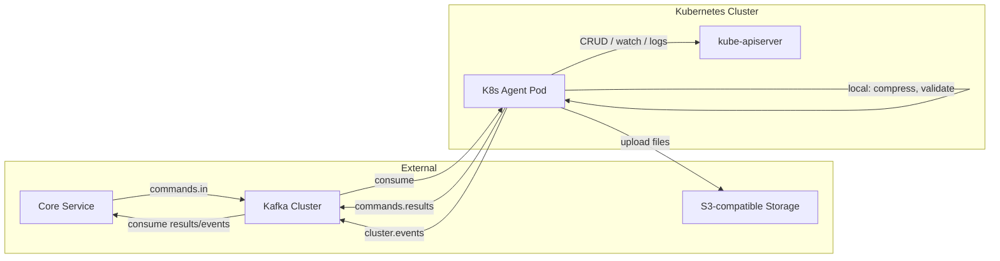
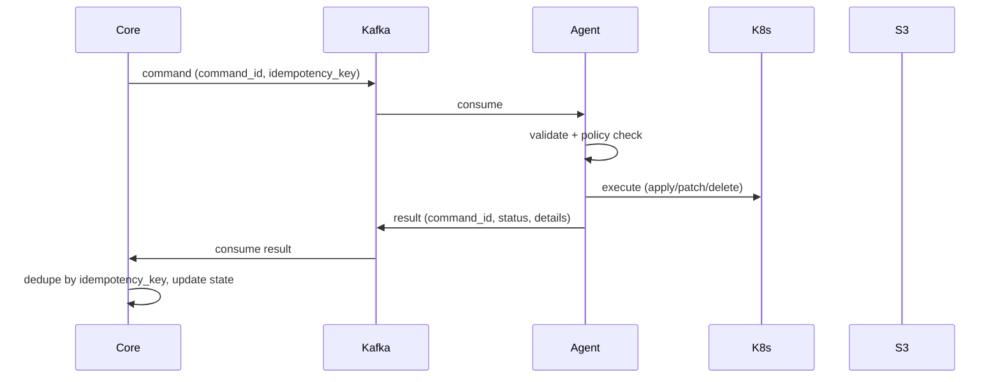

# K8s Agent — архитектура сервиса

> **Статус:** согласованный черновик для реализации  
> **Стек:** Go, Kafka (external), Kubernetes API, Istio CRD, S3-compatible storage  
> **Модель:** агент + ядро (core) — агент stateless, состояние и идемпотентность на стороне core

---

## 1. Назначение

**K8s Agent** — in-cluster сервис на Go, который:

1. Получает команды из **внешней Kafka** (топик `commands.in`).
2. Выполняет операции **локально в pod** (оркестрация, обработка файлов) и **в Kubernetes/Istio API**.
3. Публикует результат выполнения в Kafka (`commands.results`).
4. Поддерживает **watch-подписки** на изменения в кластере и стримит события в Kafka (`cluster.events`).
5. Скачивает файлы из разных источников и загружает их в **S3-compatible** хранилище.

**Ядро (core)** — внешний сервис, который:

- Отправляет команды агенту.
- Хранит идемпотентность, историю команд, состояние watch-подписок.
- При рестарте агента переотправляет активные `watch.subscribe`.
- Обрабатывает результаты и события из Kafka.

Агент **не хранит** долгоживущее состояние (нет Redis, PostgreSQL, CRD для idempotency).

---

## 2. Контекст и ограничения

| Решение | Значение |
|---|---|
| Язык | Go |
| Kafka | Вне k8s-кластера (managed / отдельный кластер) |
| S3 | S3-compatible (Yandex Object Storage, Selectel, Ceph и т.п.) |
| Модель команд | `generic_limited` — CRUD по GVK с allow-list GVK + namespaces |
| Producer команд | Внешняя система (core) |
| Ответ | Обязательный топик `commands.results` (correlation по `command_id`) |
| Идемпотентность | На стороне core; агент всегда публикует result |
| Watch state | Core хранит подписки, при рестарте агента переотправляет `watch.subscribe` |
| Multi-cluster | Один агент = один k8s-кластер (in-cluster config) |
| Istio CRD (Phase 1) | VirtualService, DestinationRule, Gateway |
| Формат cluster.events | Metadata + JSON diff (old/new) для UPDATE |

---

## 3. Архитектура



### 3.1. Принцип «агент + ядро»



Агент **at-least-once**: может выполнить команду повторно при rebalance/restart. Core обязан дедуплицировать по `idempotency_key` и не считать повторный `completed` ошибкой.

---

## 4. Kafka-топики

| Топик | Направление | Назначение |
|---|---|---|
| `commands.in` | Core → Agent | Входящие команды |
| `commands.results` | Agent → Core | Результаты выполнения (обязательный) |
| `cluster.events` | Agent → Core | События watch-подписок |
| `commands.dlq` | Agent → Core | «Ядовитые» сообщения после исчерпания ретраев |

**Ключ партиционирования:** `{namespace}/{name}` или `{command_id}` — для сериализации команд по одному ресурсу.

**Commit offset:** только после успешной публикации в `commands.results` (или `commands.dlq`).

**Формат сообщений:** JSON на старте; при необходимости эволюции — Avro/Protobuf + Schema Registry.

---

## 5. Контракт сообщений

### 5.1. Команда (envelope)

```json
{
  "command_id": "550e8400-e29b-41d4-a716-446655440000",
  "idempotency_key": "core:job:12345",
  "type": "resource.apply",
  "issued_by": "core-prod",
  "ts": "2026-06-28T12:00:00Z",
  "dry_run": false,
  "target": {
    "group": "networking.istio.io",
    "version": "v1beta1",
    "kind": "VirtualService",
    "namespace": "app",
    "name": "my-vs"
  },
  "payload": {}
}
```

### 5.2. Типы команд (`command.type`)

#### Resource — операции с k8s/Istio

| type | Описание |
|---|---|
| `resource.apply` | Server-side apply manifest |
| `resource.patch` | Strategic merge / JSON patch |
| `resource.delete` | Удаление ресурса |
| `resource.get` | Получение одного ресурса |
| `resource.list` | List по selector |

Payload: manifest (apply), patch body (patch), labelSelector (list).

#### Watch — подписки на события кластера

| type | Описание |
|---|---|
| `watch.subscribe` | Создать подписку |
| `watch.unsubscribe` | Удалить подписку |

Payload для `watch.subscribe`:

```json
{
  "subscription_id": "sub-abc123",
  "selector": {
    "labelSelector": "app=processor",
    "fieldSelector": ""
  },
  "event_filter": ["ADD", "UPDATE", "DELETE", "RESTART", "K8S_EVENT"],
  "gvk": { "group": "", "version": "v1", "kind": "Pod" },
  "namespace": "app",
  "ttl_seconds": 86400
}
```

Подписки хранятся **in-memory в агенте**. Core при рестарте агента переотправляет все активные `watch.subscribe`.

#### File — скачивание и загрузка в S3

| type | Описание |
|---|---|
| `file.fetch` | Long-running: скачать → обработать локально → upload S3 |

Payload:

```json
{
  "source": "pod_logs",
  "source_params": {
    "namespace": "app",
    "pod": "processor-abc",
    "container": "processor",
    "since_seconds": 3600
  },
  "destination": {
    "bucket": "backups",
    "key": "logs/processor-abc/2026-06-28.log.gz",
    "content_type": "application/gzip"
  },
  "local_processing": ["gzip"]
}
```

Источники (`source`):

| source | Описание |
|---|---|
| `pod_logs` | Stream логов pod → S3 |
| `pod_cp` | Файл из pod (exec/tar) → S3 |
| `resource_export` | Dump ресурсов (YAML/JSON, gzip) → S3 |
| `http_url` | Скачивание по URL (с egress policy) → S3 |

Локальная обработка (`local_processing`): `gzip`, `tar`, checksum — выполняется **в pod агента** перед upload.

### 5.3. Результат (`commands.results`)

```json
{
  "command_id": "550e8400-e29b-41d4-a716-446655440000",
  "idempotency_key": "core:job:12345",
  "status": "completed",
  "phase": "executing",
  "started_at": "2026-06-28T12:00:01Z",
  "finished_at": "2026-06-28T12:00:03Z",
  "details": {
    "resource_version": "12345",
    "s3_uri": "s3://backups/logs/processor-abc/2026-06-28.log.gz",
    "bytes": 1048576
  },
  "error": null
}
```

**status:** `received` | `validated` | `executing` | `completed` | `failed` | `rejected`

Для long-running (`file.fetch`): промежуточные results с `"phase": "executing"`, `"progress": 45`.

**rejected** — policy violation, невалидный payload (без обращения к k8s API).

### 5.4. Событие watch (`cluster.events`)

```json
{
  "subscription_id": "sub-abc123",
  "event_type": "UPDATE",
  "resource": {
    "group": "networking.istio.io",
    "version": "v1beta1",
    "kind": "VirtualService",
    "namespace": "app",
    "name": "my-vs"
  },
  "observed_at": "2026-06-28T12:05:00Z",
  "details": {
    "restart_count": 3,
    "container": "processor",
    "diff": {
      "old": { "spec": { "hosts": ["old.example.com"] } },
      "new": { "spec": { "hosts": ["new.example.com"] } }
    }
  }
}
```

**event_type:** `ADD` | `UPDATE` | `DELETE` | `RESTART` | `K8S_EVENT`

**Формат payload:** metadata всегда; для `UPDATE` — JSON diff (`old`/`new`) в `details.diff`. Для `RESTART` — `restart_count` + container. Полный resource body **не** отправляется.

---

## 6. Компоненты агента

```
k8s-agent/
├── cmd/agent/              # main, wiring, graceful shutdown
├── internal/
│   ├── kafka/              # consumer group, producer, DLQ
│   ├── command/            # envelope, validation, router
│   ├── policy/             # allow-list GVK/namespaces/issuers
│   ├── handlers/
│   │   ├── resource/       # apply/patch/delete/get/list
│   │   ├── watch/          # subscribe/unsubscribe
│   │   └── file/           # fetch pipeline
│   ├── watchmanager/       # informers, restart detection, in-memory subs
│   ├── k8s/                # dynamic client, RESTMapper, informer factory
│   ├── local/              # gzip, tar, temp files, checksums
│   ├── s3/                 # aws-sdk-go-v2, multipart upload
│   └── result/             # publisher в commands.results
├── deploy/                 # Deployment, RBAC, SA, ConfigMap policy
└── docs/                   # (ссылка на docs/k8s-agent-architecture.md)
```

### 6.1. Policy Engine

Проверка **до** handler. Конфиг через ConfigMap:

```yaml
allowed_gvk:
  - { group: networking.istio.io, version: v1beta1, kind: VirtualService }
  - { group: networking.istio.io, version: v1beta1, kind: DestinationRule }
  - { group: networking.istio.io, version: v1beta1, kind: Gateway }
  - { group: apps, version: v1, kind: Deployment }
allowed_verbs: [get, list, watch, create, update, patch, delete, apply]
allowed_namespaces: [app, istio-system]
issuer_rules:
  - issuer: core-prod
    namespaces: [app]
file_fetch:
  max_bytes: 1073741824          # 1 GiB
  allowed_url_domains: [cdn.example.com]
  allowed_buckets: [backups, exports]
```

### 6.2. K8s / Istio доступ

- **client-go** dynamic client + RESTMapper — универсальный путь для kube + Istio CRD.
- In-cluster config (ServiceAccount token).
- Informers — для watch-подписок и read-before-write в resource handlers.

### 6.3. WatchManager

- Работает **только на leader** (coordination.k8s.io/Lease).
- In-memory map `subscription_id → InformerHandle`.
- Pod UPDATE → сравнение `restartCount` → emit `RESTART`.
- Core Events informer → emit `K8S_EVENT`.
- Istio CRD changes → emit `UPDATE`/`DELETE`.
- При получении `watch.unsubscribe` — stop informer, удалить из map.
- При старте агента — пустой; core переотправляет подписки.

### 6.4. FilePipeline

1. Скачать из источника (k8s API / HTTP).
2. Локальная обработка (gzip, tar) во временной директории (`emptyDir`).
3. Multipart upload в S3.
4. Publish result с `s3_uri` и `bytes`.
5. Cleanup temp files.

S3 клиент: **aws-sdk-go-v2** с кастомным endpoint (S3-compatible). Credentials через Secret.

### 6.5. Leader election и масштабирование

| Компонent | Масштабирование |
|---|---|
| Command consumer (`resource.*`, `file.fetch`) | Kafka consumer group, параллелизм = число партиций |
| WatchManager | Только leader pod |
| Standby pods | readiness=false, ждут leader lock |

---

## 7. Безопасность

### 7.1. RBAC (ServiceAccount)

```yaml
# Минимальный набор — уточнить под финальный allow-list
rules:
  - apiGroups: [networking.istio.io]
    resources: [virtualservices, destinationrules, gateways]
    verbs: [get, list, watch, create, update, patch, delete]
  - apiGroups: [apps]
    resources: [deployments]
    verbs: [get, list, watch, create, update, patch, delete]
  - apiGroups: [""]
    resources: [pods, pods/log, events]
    verbs: [get, list, watch]
  - apiGroups: [""]
    resources: [pods/exec]
    verbs: [create]    # только если включён pod_cp
  - apiGroups: [coordination.k8s.io]
    resources: [leases]
    verbs: [get, create, update]
```

Namespace-scoped RoleBinding предпочтительнее ClusterRoleBinding.

### 7.2. Kafka

- TLS + SASL (SCRAM или mTLS) для подключения к external Kafka.
- ACL: агент — read `commands.in`, write `commands.results` + `cluster.events` + `commands.dlq`.

### 7.3. S3

- Credentials через Secret (access key + secret key + endpoint + region).
- Allow-list buckets в policy ConfigMap.

### 7.4. Egress

- `http_url` source: allow-list доменов.
- NetworkPolicy: egress только к Kafka, S3 endpoint, kube-apiserver.

---

## 8. Надёжность

| Аспект | Решение |
|---|---|
| Delivery | At-least-once (Kafka) |
| Idempotency | Core dedupe по `idempotency_key` |
| Retries | Exponential backoff внутри агента (3–5 попыток для k8s API) |
| Poison messages | DLQ после исчерпания ретраев |
| Graceful shutdown | Finish in-flight commands → publish results → commit offsets |
| Health | Liveness: process alive; Readiness: Kafka connected + (leader OR standby) |

---

## 9. Observability

- **Prometheus metrics:** commands_total, commands_duration, kafka_lag, watch_subscriptions_active, file_upload_bytes, errors_total.
- **Structured logging:** JSON, correlation по `command_id`.
- **k8s Events:** опционально, для критичных операций (delete, apply).

---

## 10. Деплой

- `Deployment` в namespace `app` (или dedicated `k8s-agent`).
- 2 replicas (1 leader + 1 standby).
- `emptyDir` для temp files (file pipeline).
- Env: `KAFKA_BROKERS`, `KAFKA_*_TOPIC`, `S3_ENDPOINT`, `S3_REGION`, `POLICY_CONFIGMAP`.
- Манифесты: `k8s/k8s-agent/` (рядом с существующими сервисами проекта).

---

## 11. Фазы реализации

### Phase 1 — MVP (каркас + resource CRUD)

- [ ] Go module scaffold (`k8s-agent/`)
- [ ] Kafka consumer/producer (segmentio/kafka-go), DLQ
- [ ] Command envelope, validation, router
- [ ] Policy engine (ConfigMap)
- [ ] Handlers: `resource.apply`, `resource.get`, `resource.delete`
- [ ] Result publisher (`commands.results`)
- [ ] Leader election skeleton
- [ ] Deploy manifests + RBAC
- [ ] Unit tests: policy, envelope validation

### Phase 2 — Watch

- [ ] WatchManager (in-memory subscriptions)
- [ ] Handlers: `watch.subscribe`, `watch.unsubscribe`
- [ ] Pod restart detection, core Events, Istio CRD changes
- [ ] Publisher `cluster.events`
- [ ] Integration test с mock Kafka

### Phase 3 — File pipeline + S3

- [ ] S3 client (aws-sdk-go-v2, custom endpoint)
- [ ] Sources: `pod_logs`, `resource_export`, `http_url`
- [ ] Local processing: gzip
- [ ] Handler `file.fetch` с progress results
- [ ] Source: `pod_cp` (если одобрен exec в RBAC)

### Phase 4 — Hardening

- [ ] Prometheus metrics
- [ ] Graceful shutdown, chaos testing (pod kill, Kafka rebalance)
- [ ] Rate limiting k8s API calls
- [ ] Schema Registry (если потребуется)

---

## 12. Технологический стек

| Компонент | Библиотека |
|---|---|
| Kafka | segmentio/kafka-go |
| K8s client | k8s.io/client-go (dynamic + informers) |
| Leader election | k8s.io/client-go/tools/leaderelection |
| S3 | aws-sdk-go-v2/service/s3 |
| Config | env + ConfigMap (policy) |
| Logging | log/slog (structured JSON) |
| Metrics | prometheus/client_golang |

---

## 13. Открытые вопросы

1. ~~**Istio CRD allow-list**~~ — **закрыто:** VirtualService, DestinationRule, Gateway.
2. ~~**Объём событий watch**~~ — **закрыто:** metadata + JSON diff для UPDATE.
3. **Presigned URL:** нужен ли в result для скачанных файлов (генерирует core или агент)?
4. **Rate limits:** ожидаемый RPS команд и events/sec — для sizing партиций и memory informers.
5. **dry_run / confirm:** нужен ли двухфазный `confirm_token` для delete и других опасных операций?
6. **Schema Registry:** планируется ли на external Kafka?
7. **S3 provider:** конкретный провайдер (Yandex / Selectel / Ceph) — для тестирования endpoint и auth.
8. **Число партиций** топика `commands.in` — от expected throughput.

---

## 14. Связь с существующим проектом

- Сервисы **не** отправляют команды напрямую — только core (внешняя система).
- K8s Agent деплоится как отдельный Go-сервис в том же к8s-кластере.

---

## 15. Решения, которые сознательно не приняты

| Альтернатива | Причина отказа |
|---|---|
| kubectl-as-a-service | Слишком широкие права; выбран `generic_limited` |
| Локальное хранение idempotency (CRD/Redis/PostgreSQL) | Архитектура agent + core: dedupe на core |
| CRD WatchSubscription в etcd | Core хранит подписки и переотправляет при рестарте |
| agent | client-go ecosystem, single static binary |
| Kafka inside cluster | Kafka external по решению |
