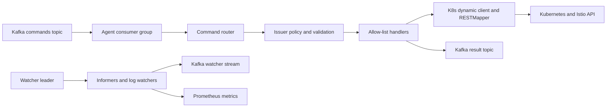

# План MVP Kubernetes Kafka Agent

## Зафиксированные решения

- Базовый вариант: гибридный агент из [design-draft.md](design-draft.md), стартующий как императивный исполнитель команд с отдельным watcher-контуром.
- Scope безопасности: агент работает только внутри одного Kubernetes-кластера через in-cluster `ServiceAccount`; внешнее управление кластерами не поддерживается.
- Команды: смешанная модель, где опасные и основные операции идут через allow-list, а generic dynamic-подход используется как внутренний механизм доступа к Kubernetes/Istio API.
- Ресурсы MVP: Kubernetes workloads/services/configmaps/secrets и основные Istio CRD: `VirtualService`, `DestinationRule`, `Gateway`, `AuthorizationPolicy`.
- Kafka: versioned JSON-сообщения, `result topic` для статуса каждой команды.
- Порядок: для входящих команд строгий порядок не требуется; для watcher-потока порядок важен и должен обеспечиваться ключами сообщений/партиционированием по ресурсу или pod/log stream.
- Авторизация: `issuer -> allowed namespaces/resources/verbs` плюс Kafka ACL; RBAC остаётся последней линией защиты.
- Опасные операции: policy-флаг `require_confirmation`, опциональный `dry_run`; delete/scale-to-zero/изменения security policy должны проходить через отдельные проверки.
- Масштабирование: все pod могут читать Kafka через consumer group, но watcher/reconcile контур должен иметь отдельный leadership/coordination.
- CRD для команд в MVP не вводим: команды выполняются из Kafka напрямую, статусы уходят в result topic, аудит обеспечивается логами/метриками/Kafka retention.

## Целевая схема

## Контракт MVP

- Входящая команда должна содержать `schema_version`, `command_id`, `correlation_id`, `type`, `issuer`, `target`, `payload`, `dry_run`, `idempotency_key`, `timeout`, `issued_at`.
- `target` должен явно задавать `group`, `version`, `kind`, `namespace`, `name`.
- `type` должен маршрутизироваться на allow-list handler, например `k8s.apply`, `k8s.patch`, `k8s.delete`, `istio.apply`, `workload.scale`.
- Результат должен содержать `command_id`, `correlation_id`, `status`, `reason`, `resource_ref`, `observed_generation/resource_version` где применимо, `started_at`, `finished_at`, `error`.
- Watcher stream должен публиковать resource events/state changes и pod logs/events по allow-list ресурсов; ключ сообщения должен сохранять порядок внутри одного ресурса или log stream.

## Этапы реализации

1. Обновить архитектурный документ [design-draft.md](design-draft.md): заменить открытые вопросы на принятые решения и добавить MVP-схему, контракт сообщений, security model и scaling model.
2. Инициализировать Go-проект и структуру пакетов: `cmd/agent`, `internal/kafka`, `internal/command`, `internal/policy`, `internal/handlers`, `internal/k8s`, `internal/watch`, `internal/result`, `deploy`.
3. Реализовать versioned JSON-модели команд/результатов, валидацию envelope и маршрутизацию по `type`.
4. Реализовать Kafka consumer group на `segmentio/kafka-go`, result publisher, DLQ-путь и offset commit только после success/result или DLQ.
5. Реализовать in-cluster Kubernetes client: dynamic client, RESTMapper discovery cache, server-side apply/patch/delete helpers и базовые проверки namespace/resource.
6. Реализовать policy engine: mapping `issuer` на разрешённые namespaces/resources/verbs, проверки dangerous operations, `require_confirmation`, опциональный `dry_run`.
7. Реализовать allow-list handlers для MVP-ресурсов Kubernetes и Istio.
8. Реализовать watcher-контур: informers для allow-list ресурсов, публикация state/resource events, отдельный ordered key strategy для watcher stream, базовая поддержка pod logs/events.
9. Добавить deployment manifests: `ServiceAccount`, минимальный `Role/ClusterRole`, `Deployment`, config/secrets, probes, metrics endpoint.
10. Добавить тесты: unit-тесты валидации/политик/роутинга, handler tests с fake dynamic client, Kafka boundaries через интерфейсы, watcher ordering tests для key strategy.

## Проверка готовности MVP

- Команда из Kafka валидируется, авторизуется, выполняется against Kubernetes/Istio API и публикует result.
- Дубликат команды не приводит к неконтролируемому повторному эффекту для идемпотентных операций.
- Опасная операция блокируется policy без подтверждения.
- Watcher публикует события и логи с сохранением порядка в пределах выбранного ключа.
- RBAC агента не шире фактически поддерживаемого allow-list MVP.
