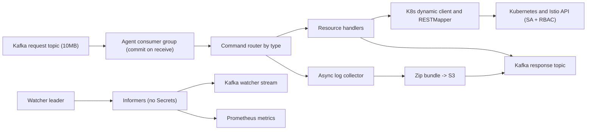

# План MVP Kubernetes Kafka Agent

## Зафиксированные решения

- Базовый вариант: гибридный агент из [design-draft.md](design-draft.md), стартующий как императивный исполнитель команд с отдельным watcher-контуром.
- Scope безопасности: агент работает только внутри одного Kubernetes-кластера через in-cluster `ServiceAccount`; внешнее управление кластерами не поддерживается.
- Авторизация (решение): жёсткая граница доступа — `ServiceAccount` агента + `RBAC`. Дополнительно агент применяет **allow-list** (defense-in-depth) — конфигурируемый список разрешённых операций (verb × resource/GVK + допустимые типы команд, например `logs.collect`); всё, что не в allow-list, отклоняется агентом до обращения к apiserver. Это ограничивает иначе «прозрачный» туннель. Подтверждения опасных операций (`require_confirmation`), per-issuer mapping и `dry_run`-gate в MVP не вводим. Следствие: все клиенты, имеющие доступ к request-топику, разделяют один набор прав агента (мультиарендность регулируется отдельными агентами/`ServiceAccount`, а не политикой внутри агента).
- Усечение ответов (решение): агент усекает ответы перед отправкой в Kafka. Настройки усечения — в конфиге агента. По умолчанию срезаются `metadata.managedFields` и `kubectl.kubernetes.io/last-applied-configuration`; опционально (по конфигу) — `status` и др. Поля, нужные клиенту (`resourceVersion` и т.п.), сохраняются. Дополнительно: compression продюсера (`zstd`/`lz4`) и пагинация `LIST`.
- Секреты (решение): `Secret` полностью исключены из scope. Агент не читает, не пишет, не наблюдает и не публикует `Secret`; в watcher-потоке и в логах не должно быть содержимого `Secret`. RBAC агента не должен включать доступ к `secrets`.
- Ресурсы MVP: Kubernetes workloads/services/configmaps (без `secrets`) и основные Istio CRD: `VirtualService`, `DestinationRule`, `Gateway`, `AuthorizationPolicy`.
- Kafka (решение): versioned JSON-сообщения; модель request/response — `request topic` для команд и `response topic` для результата каждой команды. `max.message.bytes` топиков = 10 МБ. `correlation_id` и `reply_topic` передаются в **заголовках** Kafka-сообщения (request-reply pattern), агент отвечает в `reply_topic` из заголовка.
- Обработка (решение): получили сообщение из request-топика → **сразу коммитим offset** → выполняем команду → публикуем ответ в response-топик. Это at-most-once по исполнению: при падении агента после коммита команда теряется и автоматически не переисполняется; повтор инициирует клиент (для идемпотентных операций это безопасно). Dual-write/transactional-outbox не вводим.
- Порядок: для входящих команд строгий порядок не требуется; для watcher-потока порядок важен и должен обеспечиваться ключами сообщений/партиционированием по ресурсу или pod/log stream.
- Сбор логов (решение): запрос логов может охватывать множество подов и все контейнеры (current + previous). Агент выполняет **асинхронный** сбор всех запрошенных логов, раскладывает их по структуре `deployment/pod/container-<state>-<timestamp>.log`, упаковывает в zip, загружает в S3 и в ответе возвращает ключ файла (bucket/key), а не сами логи.
- S3 (решение): **endpoint** S3 задаётся в конфиге агента (под него всё равно нужно настраивать egress). **Креды** к S3 передаются в самом запросе `logs.collect`. Следствие по безопасности: креды попадают в Kafka-сообщение — request-топик должен быть с ACL/шифрованием, креды короткоживущие и не должны попадать в логи агента. (Опция на будущее: возвращать presigned URL вместо ключа, чтобы клиенту не нужны были read-креды.)
- fabric8 (решение): фиксируем версию клиента `io.fabric8` = **7.7.0** (модель, istio-client, сериализация, `HttpClient` SPI).
- Масштабирование: все pod могут читать Kafka через consumer group, но watcher/reconcile контур должен иметь отдельный leadership/coordination.
- CRD для команд в MVP не вводим: команды выполняются из Kafka напрямую, статусы уходят в response topic, аудит обеспечивается логами/метриками/Kafka retention.
- Клиент (решение): на стороне приложения предоставляется Java-библиотека в стиле fabric8, которая работает с kube-api/Istio через Kafka. Детали — в [java-client-design.md](java-client-design.md).

## Целевая схема

## Контракт MVP

- Заголовки Kafka-сообщения: `correlation_id`, `reply_topic` (по ним идёт маршрутизация ответа; агент отвечает в `reply_topic`).
- Тело входящей команды должно содержать `schema_version`, `command_id`, `type`, `issuer` (только для аудита/трассировки, не для авторизации), `target`, `payload`, `idempotency_key`, `timeout`, `issued_at`.
- `target` должен явно задавать `group`, `version`, `kind`, `namespace`, `name`.
- `type` маршрутизируется на handler, например `k8s.apply`, `k8s.patch`, `k8s.delete`, `k8s.get`, `istio.apply`, `workload.scale`, а также высокоуровневые задания, например `logs.collect`. Перед исполнением `type`/`target` проверяются против allow-list агента.
- `logs.collect` должен принимать выборку подов (или label-selector + namespace), флаг сбора `current`/`previous` контейнеров, опциональные `sinceTime`/`tailLines`/`limitBytes` и **креды S3** (endpoint берётся из конфига агента); результат — ссылка на S3-объект, а не содержимое логов.
- Результат должен содержать `command_id`, `correlation_id`, `status`, `reason`, `resource_ref`, `observed_generation/resource_version` где применимо, `started_at`, `finished_at`, `error`; для `logs.collect` дополнительно `s3_bucket`, `s3_key`, `byte_size`, `file_count`, `partial_errors`.
- Watcher stream должен публиковать resource events/state changes по allow-list ресурсов (`Secret` исключён полностью); ключ сообщения должен сохранять порядок внутри одного ресурса или log stream.

## Этапы реализации

1. Обновить архитектурный документ [design-draft.md](design-draft.md): заменить открытые вопросы на принятые решения и добавить MVP-схему, контракт сообщений, security model и scaling model.
2. Инициализировать Go-проект и структуру пакетов: `cmd/agent`, `internal/kafka`, `internal/command`, `internal/handlers`, `internal/k8s`, `internal/logs`, `internal/s3`, `internal/watch`, `internal/result`, `deploy`.
3. Реализовать versioned JSON-модели команд/результатов, валидацию envelope и маршрутизацию по `type`.
4. Реализовать Kafka request consumer group на `segmentio/kafka-go` и response publisher: commit offset сразу после получения, затем выполнение и публикация ответа в `reply_topic` из заголовка (at-most-once, без DLQ). Включить compression продюсера.
5. Реализовать allow-list агента: конфигурируемый список разрешённых `type`/verb × resource/GVK; запросы вне списка отклоняются до обращения к apiserver.
6. Реализовать in-cluster Kubernetes client: dynamic client, RESTMapper discovery cache (с reload на `NoMatchError`), server-side apply/patch/delete helpers, базовые проверки namespace/resource и **усечение ответов** по конфигу (срез `managedFields`/`last-applied-configuration`, опц. `status`; пагинация `LIST`). RBAC без доступа к `secrets`.
7. Реализовать handlers для MVP-ресурсов Kubernetes и Istio (`k8s.apply/patch/delete/get`, `workload.scale`, `istio.apply`). `workload.scale` — только абсолютное число реплик (идемпотентность).
8. Реализовать асинхронный сборщик логов (`logs.collect`): fan-out по подам × контейнерам × {current, previous}, раскладка в `deployment/pod/container-<state>-<timestamp>.log`, zip, загрузка в S3 (endpoint из конфига, креды из запроса), ответ с ключом объекта; backpressure и лимиты размера на сбор.
9. Реализовать watcher-контур: informers для allow-list ресурсов (без `Secret`), публикация state/resource events, отдельный ordered key strategy для watcher stream.
10. Добавить deployment manifests: `ServiceAccount`, минимальный `Role/ClusterRole` (без `secrets`), `Deployment`, конфигурация (Kafka, S3 endpoint, allow-list, правила усечения), probes, metrics endpoint.
11. Добавить тесты: unit-тесты валидации/роутинга/allow-list/усечения, handler tests с fake dynamic client, Kafka boundaries через интерфейсы, log-collector tests (layout/zip/S3 через интерфейс), watcher ordering tests для key strategy.

## Проверка готовности MVP

- Команда из request-топика валидируется, проходит allow-list, выполняется against Kubernetes/Istio API и публикует ответ в `reply_topic`; жёсткой границей доступа выступает `ServiceAccount` + `RBAC`.
- Операция вне allow-list отклоняется агентом до обращения к apiserver.
- Ответы усечены по конфигу (нет `managedFields`/`last-applied-configuration`), `LIST` пагинируется; сообщения сжимаются продюсером.
- Дубликат команды не приводит к неконтролируемому повторному эффекту для идемпотентных операций (повтор инициирует клиент по таймауту).
- `logs.collect` асинхронно собирает логи по множеству подов/контейнеров (current + previous), упаковывает в zip, кладёт в S3 (креды из запроса) и возвращает ключ объекта.
- Watcher публикует события с сохранением порядка в пределах выбранного ключа; `Secret` отсутствует во всех потоках.
- RBAC агента не включает `secrets` и не шире фактически поддерживаемого набора операций MVP.
