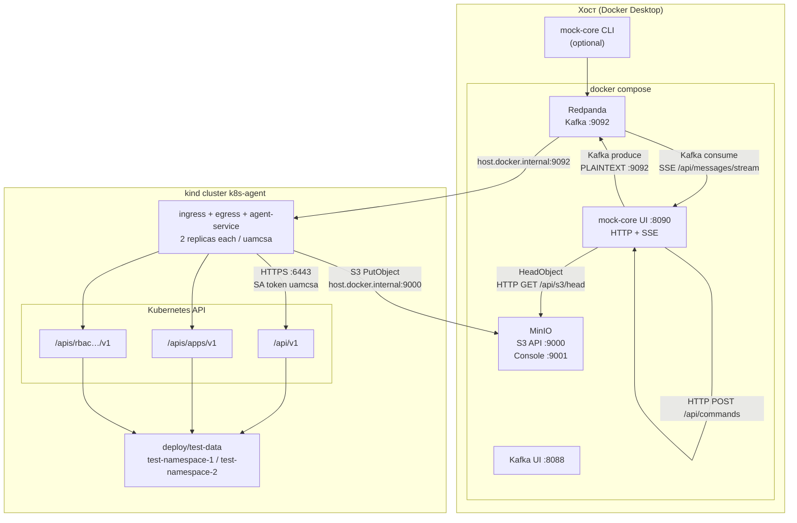
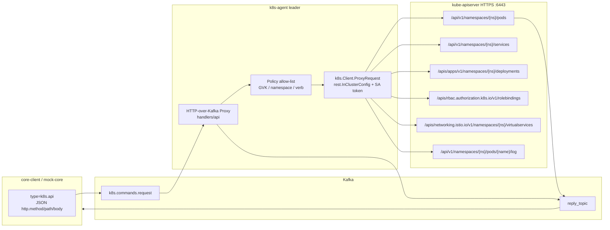
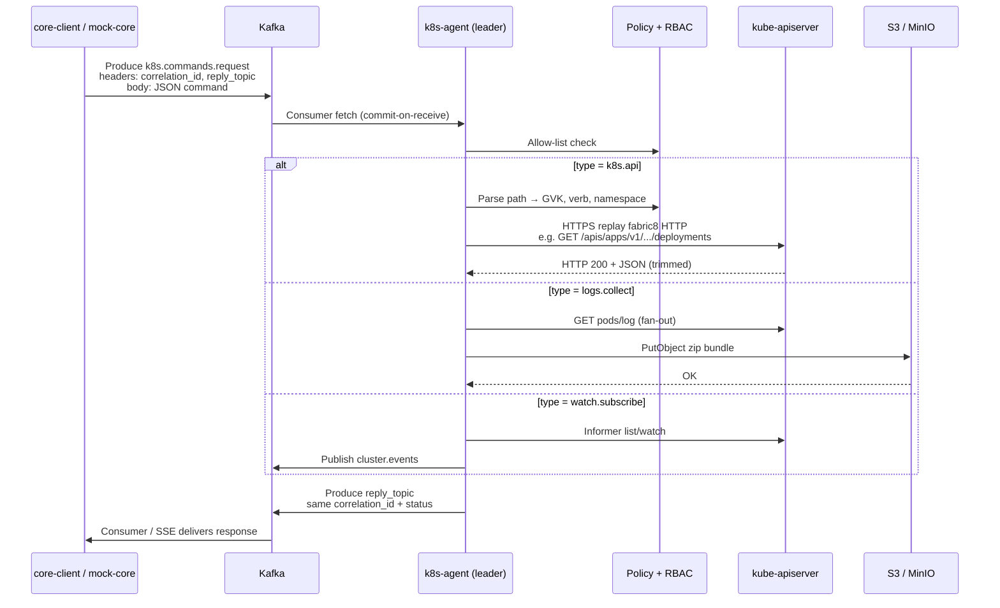
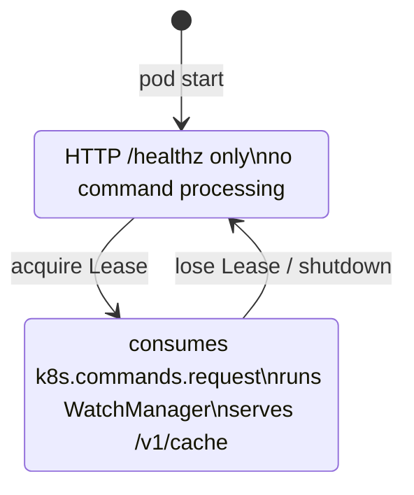

# Диаграмма взаимодействия сервисов

> Сводная схема связки **core-client (Java)** ↔ **Kafka** ↔ **k8s-agent (Go)** ↔ **Kubernetes / S3**.  
> Локальный контур: [`local-test-contour.md`](./local-test-contour.md). Детали контрактов: [`architecture-core-client-k8s-agent.md`](./architecture-core-client-k8s-agent.md).

## 1. Общая схема (production)

```mermaid
flowchart TB
    subgraph outside ["Вне Kubernetes"]
        App["Java Application"]
        Core["core-client (Java)\nfabric8 7.7.0 + KafkaHttpClient"]
    end

    subgraph kafka ["Kafka (managed)"]
        direction TB
        TReq["k8s.commands.request"]
        TReply["reply_topic\n(header, per core instance)"]
        TEvents["cluster.events"]
        TLogs["logs.stream"]
        THealth["cluster.health"]
        TLife["agent.lifecycle"]
    end

    subgraph k8s ["Kubernetes cluster"]
        direction TB
        subgraph agentNs ["namespace uamc-agent"]
            Ingress["ingress\n(HTTP gateway)"]
            Egress["egress\n(Kafka gateway)"]
            Leader["agent-service\n(leader)"]
            Follower["agent-service\n(follower)"]
            Lease["Lease\ncoordination.k8s.io"]
            HTTPsvc["Service k8s-agent-http\n:8080"]
            InternalSvc["Service agent-service-http\n:8081"]
        end
        subgraph k8sApi ["Kubernetes API (kube-apiserver)"]
            direction TB
            CoreAPI["Core API /api/v1\nPods, Services, ConfigMaps, Events"]
            AppsAPI["Apps API /apis/apps/v1\nDeployments"]
            RbacAPI["RBAC API /apis/rbac.authorization.k8s.io/v1\nRoles, RoleBindings"]
            IstioAPI["Istio API /apis/networking.istio.io/v1\nVirtualService, Gateway, …"]
            CoordAPI["Coordination API /apis/coordination.k8s.io/v1\nLeases"]
            LogsAPI["Subresource …/log\nPod logs"]
        end
        SA["ServiceAccount uamcsa\n+ RoleBinding per namespace"]
        Workloads["Cluster resources\nPods, Deployments, CRD"]
    end

    subgraph s3 ["Object storage"]
        S3["S3-compatible\nPutObject"]
    end

    App --> Core
    Core -->|"Kafka produce\nJSON envelope + headers"| TReq
    TReply -->|"Kafka consume\nJSON response"| Core
    TEvents --> Core
    TLogs --> Core
    THealth --> Core
    TLife --> Core

    TReq -->|"Kafka consume\ngroup: k8s-agent\n(leader only)"| Leader
    Leader -->|"Kafka produce"| TReply
    Leader --> TEvents
    Leader --> TLogs
    Leader --> THealth
    Leader --> TLife

    Leader -->|"k8s.api handler\nHTTP-over-Kafka proxy"| CoreAPI
    Leader --> AppsAPI
    Leader --> RbacAPI
    Leader --> IstioAPI
    Leader -->|"leader election"| CoordAPI
    Leader -->|"logs.collect / stream / health"| LogsAPI
    CoreAPI --> Workloads
    AppsAPI --> Workloads
    RbacAPI --> Workloads
    IstioAPI --> Workloads
    LogsAPI --> Workloads
    Leader --> SA
    Leader <-->|"Lease lock"| Lease
    Follower -.->|"standby\nno commands"| Lease

    Leader -->|"AWS SDK\nHTTP PUT"| S3
    Leader -->|"GET /v1/cache\nGET /metrics"| HTTPsvc
```

## 2. Локальный тестовый контур

В dev/mock окружении **core-client (Java)** заменяется **mock-core UI** или CLI `hack/mock-core`; Kafka и S3 — контейнеры на хосте; агент — in-cluster (kind).

## 2.1 Kubernetes API — детализация

Агент **не вызывает Kubernetes API напрямую из core**. Core отправляет команду `k8s.api` через Kafka; агент **воспроизводит HTTP-запрос** fabric8 к kube-apiserver от имени `uamcsa`.

### API groups и примеры путей

| API group | Base path | Ресурсы (MVP allow-list) | Пример команды / handler |
| --- | --- | --- | --- |
| Core `""` | `/api/v1` | Pod, Service, ConfigMap, Event | `GET /api/v1/namespaces/test-namespace-1/pods` → `k8s.api` |
| `apps` | `/apis/apps/v1` | Deployment | `GET /apis/apps/v1/namespaces/test-namespace-1/deployments` |
| `rbac.authorization.k8s.io` | `/apis/rbac.authorization.k8s.io/v1` | Role, RoleBinding | `GET …/rolebindings` (cluster или ns scope) |
| `networking.istio.io` | `/apis/networking.istio.io/v1` | VirtualService, Gateway, … | fabric8 Istio CRUD через `k8s.api` |
| `coordination.k8s.io` | `/apis/coordination.k8s.io/v1` | Lease | leader election (внутренний, не через Kafka) |
| Subresources | `…/log` | Pod logs | `logs.collect`, `logs.stream.start`, `health.report` |

### Типы команд → обращения к Kubernetes API

| Command `type` | К Kubernetes API | HTTP-методы | Примечание |
| --- | --- | --- | --- |
| `k8s.api` | Произвольный allow-list path | GET, LIST, PATCH, PUT, DELETE, … | Прямой HTTP proxy; ответ в `reply_topic` |
| `logs.collect` | `GET …/pods/{name}/log` | GET | Fan-out по label selector |
| `watch.subscribe` | list + watch informer | GET, WATCH | События → `cluster.events`, не в reply |
| `logs.stream.start` | `GET …/log` (stream) | GET | Chunks → `logs.stream` |
| `health.report.start` | `LIST pods` по namespace | LIST | Snapshots → `cluster.health` |
| leader election | `Lease` update/get | GET, PUT, PATCH | Внутри агента, без Kafka command |

**Auth:** Bearer token ServiceAccount `uamcsa` (монтируется в pod автоматически).  
**RBAC:** ClusterRole `k8s-agent` + namespace-scoped RoleBinding `uamcsa-agent` (без ClusterRoleBinding).  
**Запрещено:** `Secret` (policy `deny_secrets: true`).

## 3. Поток команды (request / reply)

## 4. Kafka-топики

| Топик | Направление | Транспорт | Payload | Назначение |
| --- | --- | --- | --- | --- |
| `k8s.commands.request` | core → agent | Kafka | JSON command envelope | Входящие команды (все типы) |
| `reply_topic` (header) | agent → core | Kafka | JSON response | Sync-ответ (`k8s.api`, `logs.collect`, `cache.*`, …) |
| `cluster.events` | agent → core | Kafka | JSON watch events | `watch.subscribe` (ADDED/MODIFIED/DELETED) |
| `logs.stream` | agent → core | Kafka | JSON log chunks | `logs.stream.start` live tail |
| `cluster.health` | agent → core | Kafka | JSON pod snapshots | `health.report.start` периодические снимки |
| `agent.lifecycle` | agent → core | Kafka | JSON lifecycle | `agent.started`, `agent.leader.changed` |

**Headers (обязательные):** `correlation_id`, `reply_topic`.

**Consumer group агента:** `k8s-agent` (обрабатывает только **leader** pod).

## 5. Протоколы и транспорт по связям

| От | К | Протокол | Транспорт | Порт / endpoint | Auth (prod) | Auth (local) |
| --- | --- | --- | --- | --- | --- | --- |
| core-client | Kafka | Kafka binary | TCP/TLS | `:9092` | mTLS / SASL | PLAINTEXT |
| mock-core UI | Kafka | Kafka binary | TCP | `localhost:9092` | — | PLAINTEXT |
| mock-core UI | Browser | HTTP/1.1, SSE | TCP | `:8090` | — | — |
| mock-core UI | MinIO | S3 HeadObject (AWS SDK) | HTTP | `:9000` | — | `minioadmin` |
| k8s-agent | Kafka | Kafka binary | TCP/TLS | broker | mTLS | PLAINTEXT via `host.docker.internal` |
| k8s-agent | **Kubernetes API** (kube-apiserver) | HTTPS REST (JSON) | TCP in-cluster | `:6443` | SA token `uamcsa` | same |
| k8s-agent | `/api/v1` (Core) | HTTPS JSON | TCP | Pods, Services, Events, `/log` | SA + RBAC | same |
| k8s-agent | `/apis/apps/v1` | HTTPS JSON | TCP | Deployments | SA + RBAC | same |
| k8s-agent | `/apis/rbac.authorization.k8s.io/v1` | HTTPS JSON | TCP | Roles, RoleBindings | SA + RBAC | same |
| k8s-agent | `/apis/networking.istio.io/v1` | HTTPS JSON | TCP | Istio CRD | SA + RBAC | same |
| k8s-agent | `/apis/coordination.k8s.io/v1` | HTTPS JSON | TCP | Leases (leader election) | SA | same |
| k8s-agent | S3 | S3 API (PutObject) | HTTPS/HTTP | endpoint from env | creds in command payload | MinIO path-style |
| Ops / Prometheus | k8s-agent | HTTP | TCP | `:8080` `/metrics` | Bearer token (prod overlay) | open (local) |
| Ops | k8s-agent | HTTP | TCP | `:8080` `/healthz`, `/readyz` | — | — |
| core / curl | k8s-agent | HTTP GET | TCP | `:8080` `/v1/cache/*` | Bearer (prod) | port-forward, leader only |

## 6. Типы команд и побочные каналы

| Command `type` | Kafka in | Kafka out | Другие системы |
| --- | --- | --- | --- |
| `k8s.api` | `k8s.commands.request` | `reply_topic` | kube-apiserver HTTPS |
| `logs.collect` | request | reply | apiserver logs + **S3 upload** |
| `watch.subscribe` / `unsubscribe` | request | reply + **`cluster.events`** | apiserver watch/informer |
| `logs.stream.start` / `stop` | request | reply + **`logs.stream`** | apiserver pod logs |
| `health.report.start` / `stop` | request | reply + **`cluster.health`** | apiserver list pods |
| `cache.put` / `delete` / `clear` | request | reply | in-memory cache + **HTTP GET** `/v1/cache` |
| (lifecycle) | — | **`agent.lifecycle`** | Lease leader election |

## 7. Leader election и HA

- **Lease:** `coordination.k8s.io/v1`, namespace `uamc-agent`
- **Label leader pod:** `k8s-agent/leader=true`
- **Service `k8s-agent-http`:** selector только на leader → cache API и metrics с одного pod

## 8. Компоненты локальной замены (dev)

| Production | Local dev | Протокол |
| --- | --- | --- |
| Managed Kafka | Redpanda | Kafka PLAINTEXT `:9092` |
| AWS S3 | MinIO | S3 HTTP `:9000` |
| Java core-client | mock-core UI / CLI | Kafka + HTTP UI |
| mTLS Kafka | не используется | — |
| EKS / prod K8s | kind cluster | HTTPS apiserver |

---

## Связанные файлы

- Agent config / topic defaults: [`internal/config/config.go`](../internal/config/config.go)
- Kustomize prod vs local: [`deploy/overlays/`](../deploy/overlays/)
- Test workloads: [`deploy/test-data/`](../deploy/test-data/)
- Command fixtures: [`test/fixtures/`](../test/fixtures/)
