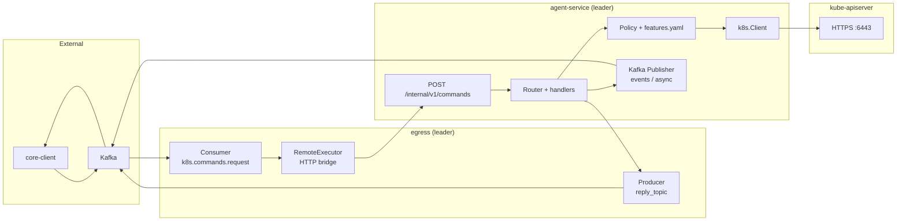
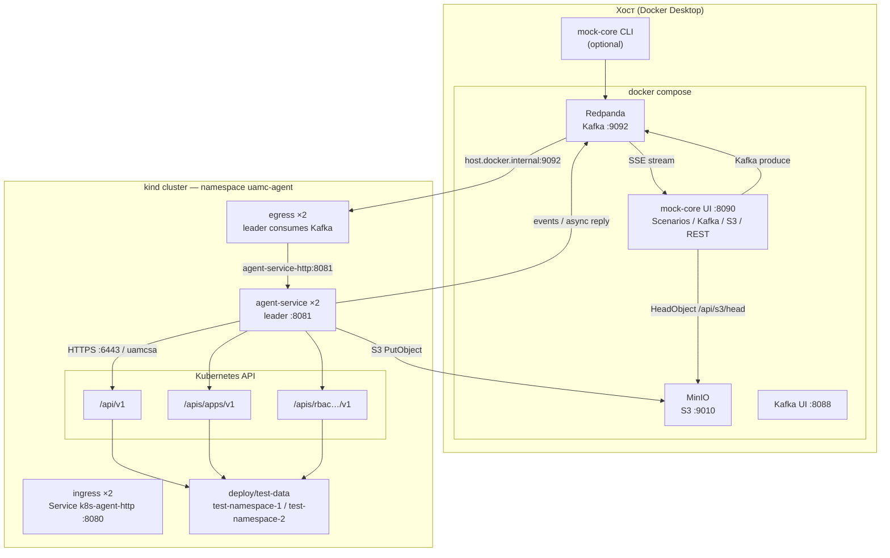
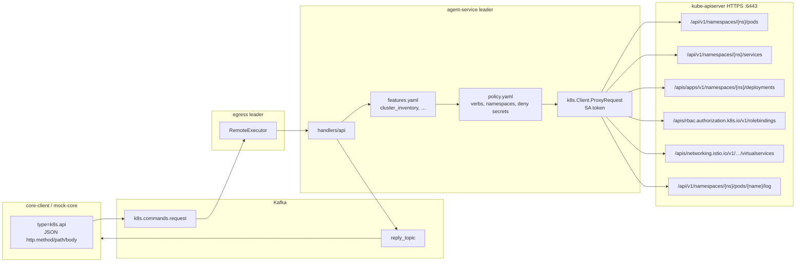
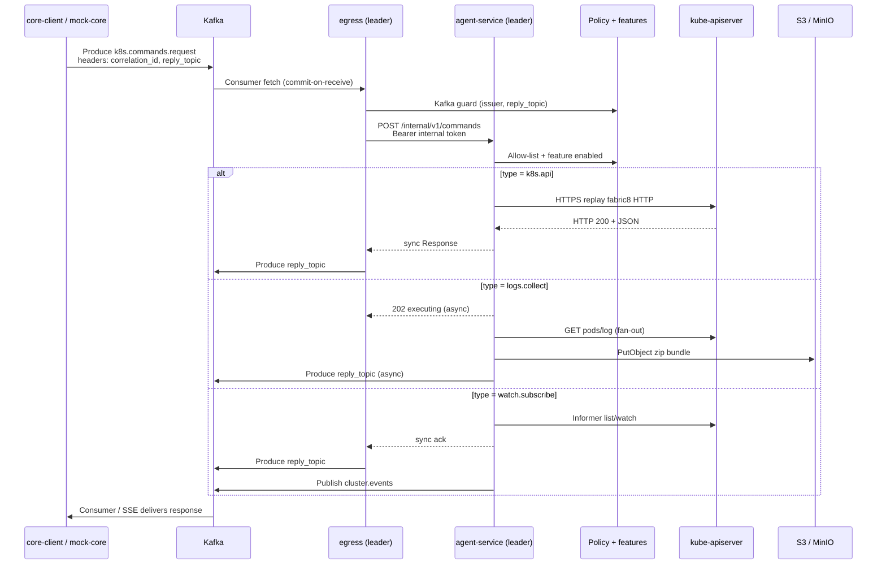
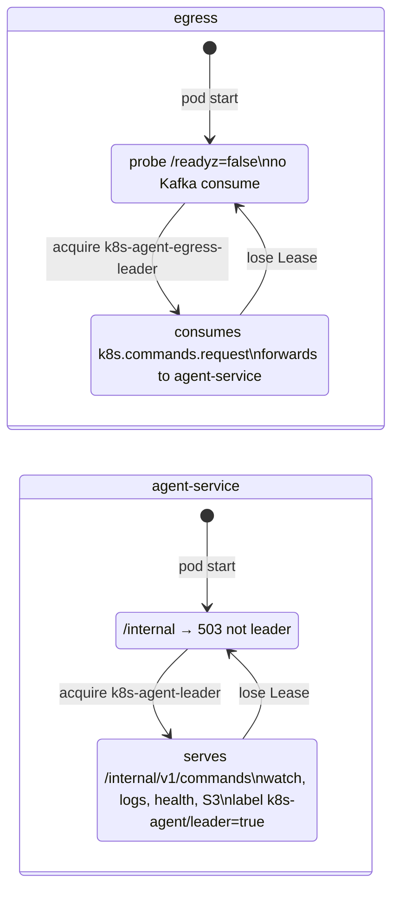

# Диаграмма взаимодействия сервисов

> Сводная схема связки **core-client (Java)** ↔ **Kafka** ↔ **uamc-agent** (ingress / egress / agent-service) ↔ **Kubernetes API / S3**.  
> Локальный контур: [`local-test-contour.md`](./local-test-contour.md). Контракты: [`architecture-core-client-k8s-agent.md`](./architecture-core-client-k8s-agent.md).  
> RBAC и feature flags: [`rbac-features-capacity.md`](./rbac-features-capacity.md).

## 1. Общая схема (production)

Агент развёрнут как **три Deployment** в namespace `uamc-agent`:

| Компонент | Kafka | Kubernetes API | Назначение |
| --- | --- | --- | --- |
| **ingress** | — | — | HTTP-шлюз: `/metrics`, `/v1/cache/*` → agent-service leader |
| **egress** | consume + produce (sync reply) | — | Kafka-шлюз: команды → internal API |
| **agent-service** | produce (events, async reply) | read/write (leader) | Выполнение команд, watch, logs, health |

```mermaid
flowchart TB
    subgraph outside ["Вне Kubernetes"]
        App["Java Application"]
        Core["core-client (Java)\nfabric8 7.7.0 + KafkaHttpClient"]
        Ops["Ops / Prometheus / curl"]
    end

    subgraph kafka ["Kafka (managed)"]
        direction TB
        TReq["k8s.commands.request"]
        TReply["reply_topic\n(header, per core instance)"]
        TEvents["cluster.events"]
        TLogs["logs.stream"]
        THealth["cluster.health"]
        TLife["agent.lifecycle"]
    end

    subgraph k8s ["Kubernetes cluster"]
        direction TB
        subgraph agentNs ["namespace uamc-agent"]
            subgraph gateways ["Gateways (×2 replicas each)"]
                Ingress["ingress\nHTTP :8080"]
                EgressL["egress leader\nKafka consumer"]
                EgressF["egress follower\nstandby"]
            end
            subgraph svcCore ["agent-service (×2 replicas)"]
                ASLeader["agent-service leader\ninternal :8081"]
                ASFollower["agent-service follower\nstandby"]
            end
            PolicyCM["ConfigMap k8s-agent-policy\npolicy.yaml + features.yaml"]
            LeaseE["Lease\nk8s-agent-egress-leader"]
            LeaseAS["Lease\nk8s-agent-leader"]
            HTTPsvc["Service k8s-agent-http\n→ ingress"]
            InternalSvc["Service agent-service-http\nselector: leader"]
        end
        subgraph k8sApi ["Kubernetes API (kube-apiserver)"]
            direction TB
            CoreAPI["Core /api/v1\nNamespace, Pod, Service, …"]
            AppsAPI["Apps /apis/apps/v1\nDeployment"]
            RbacAPI["RBAC /apis/rbac.authorization.k8s.io/v1"]
            IstioAPI["Istio /apis/networking.istio.io/v1"]
            CoordAPI["Coordination /apis/coordination.k8s.io/v1\nLeases"]
            LogsAPI["Subresource …/log"]
        end
        SA["ServiceAccount uamcsa\nRoleBinding per namespace"]
        Workloads["Cluster resources"]
    end

    subgraph s3 ["Object storage"]
        S3["S3-compatible\nPutObject"]
    end

    App --> Core
    Core -->|"Kafka produce"| TReq
    TReply -->|"Kafka consume"| Core
    TEvents --> Core
    TLogs --> Core
    THealth --> Core
    TLife --> Core

    TReq -->|"consume\ngroup: k8s-agent"| EgressL
    EgressL -->|"POST /internal/v1/commands\nBearer token"| InternalSvc
    InternalSvc --> ASLeader
    EgressL -->|"sync reply"| TReply
    ASLeader -->|"async reply, events"| TEvents
    ASLeader --> TLogs
    ASLeader --> THealth
    ASLeader --> TLife

    Ops --> HTTPsvc
    HTTPsvc --> Ingress
    Ingress -->|"reverse proxy\n/metrics, /v1/cache"| InternalSvc

    PolicyCM -.-> EgressL
    PolicyCM -.-> ASLeader

    ASLeader --> CoreAPI
    ASLeader --> AppsAPI
    ASLeader --> RbacAPI
    ASLeader --> IstioAPI
    ASLeader --> CoordAPI
    ASLeader --> LogsAPI
    CoreAPI --> Workloads
    AppsAPI --> Workloads
    RbacAPI --> Workloads
    IstioAPI --> Workloads
    LogsAPI --> Workloads
    ASLeader --> SA

    EgressL <-->|"Lease"| LeaseE
    EgressF -.-> LeaseE
    ASLeader <-->|"Lease + label"| LeaseAS
    ASFollower -.-> LeaseAS

    ASLeader -->|"logs.collect"| S3
```

## 1.1 Потоки по компонентам

## 2. Локальный тестовый контур

**core-client (Java)** заменяется **mock-core UI** или CLI; Kafka и S3 — контейнеры на хосте; в kind — три Deployment (`ingress`, `egress`, `agent-service`).

## 2.1 Kubernetes API — детализация

Core **не** вызывает Kubernetes API напрямую. Команда `k8s.api` идёт через Kafka → egress → agent-service; агент воспроизводит HTTP fabric8 к kube-apiserver от имени `uamcsa`.

### Feature groups (`features.yaml`)

| Feature ID | ClusterRole | Command types | GVK (примеры) |
| --- | --- | --- | --- |
| `cluster_inventory` | `k8s-agent-cluster-read` | `k8s.api` | Namespace, Pod, Service, ConfigMap, Event |
| `workload_manage` | `k8s-agent-workload-write` | `k8s.api` | Deployment, DeploymentConfig |
| `istio_manage` | `k8s-agent-istio-write` | `k8s.api` | VirtualService, Gateway, DestinationRule, AuthorizationPolicy |
| `rbac_inspect` | `k8s-agent-rbac-read` | `k8s.api` | Role, RoleBinding |
| `logs_collect` | `k8s-agent-logs-export` | `logs.collect` | `pods/log` |
| `logs_stream` | `k8s-agent-logs-stream` | `logs.stream.*` | `pods/log` |
| `watch_events` | `k8s-agent-watch` | `watch.subscribe/unsubscribe` | Namespace, Pod, Deployment |
| `health_report` | `k8s-agent-health` | `health.report.*` | Pod list |
| `cache` | *(нет RBAC)* | `cache.*` | in-memory only |

При `enabled: false` — PolicyDenied + handler не регистрируется. Профиль «только observability»: [`features-minimal.yaml`](../deploy/base/policy/features-minimal.yaml).

### Типы команд → Kubernetes API

| Command `type` | Компонент | К Kubernetes API | Примечание |
| --- | --- | --- | --- |
| `k8s.api` | agent-service | allow-list path | Sync reply через egress → `reply_topic` |
| `logs.collect` | agent-service | `GET …/log` | Async reply публикует **agent-service**; S3 upload |
| `watch.subscribe` | agent-service | list + watch | Sync ack через egress; события → `cluster.events` |
| `logs.stream.start` | agent-service | `GET …/log` stream | Chunks → `logs.stream` |
| `health.report.start` | agent-service | `LIST pods` | Snapshots → `cluster.health` |
| leader election | agent-service / egress | `Lease` | Два Lease: `k8s-agent-leader`, `k8s-agent-egress-leader` |

**Auth:** Bearer token ServiceAccount `uamcsa`.  
**RBAC:** namespace-scoped RoleBinding `uamcsa-agent` + ClusterRole по включённым features.  
**Запрещено:** `Secret` (`deny_secrets: true`).

## 3. Поток команды (request / reply)

## 4. Kafka-топики

| Топик | Направление | Кто публикует | Payload | Назначение |
| --- | --- | --- | --- | --- |
| `k8s.commands.request` | core → agent | core / mock-core | JSON command | Входящие команды |
| `reply_topic` (header) | agent → core | **egress** (sync) или **agent-service** (async) | JSON response | Sync/async ответ |
| `cluster.events` | agent → core | **agent-service** | JSON watch events | `watch.subscribe` |
| `logs.stream` | agent → core | **agent-service** | JSON log chunks | `logs.stream.start` |
| `cluster.health` | agent → core | **agent-service** | JSON pod snapshots | `health.report.start` |
| `agent.lifecycle` | agent → core | **agent-service** | JSON lifecycle | `agent.started`, leader changed |

**Headers (обязательные):** `correlation_id`, `reply_topic`.

**Kafka consumer:** только **egress leader** (group `k8s-agent`).

## 5. Протоколы и транспорт по связям

| От | К | Протокол | Порт / endpoint | Auth (prod) | Auth (local) |
| --- | --- | --- | --- | --- | --- |
| core-client | Kafka | Kafka binary | `:9092` | mTLS / SASL | PLAINTEXT |
| mock-core UI | Kafka | Kafka binary | `localhost:9092` | — | PLAINTEXT |
| mock-core UI | Browser | HTTP/1.1, SSE | `:8090` | — | — |
| mock-core UI | MinIO | S3 HeadObject | `:9010` | — | `minioadmin` |
| mock-core UI | Agent HTTP | REST GET | `AGENT_HTTP_URL` (`:8080`) | Bearer optional | healthz / cache |
| **egress** | Kafka | consume / produce | broker | mTLS | PLAINTEXT via `host.docker.internal` |
| **egress** | **agent-service** | HTTP POST JSON | `agent-service-http:8081/internal/v1/commands` | Bearer `HTTP_INTERNAL_BEARER_TOKEN` | Secret `k8s-agent-internal-token` |
| **ingress** | **agent-service** | HTTP reverse proxy | `:8080` → `:8081` | — (paths only) | same |
| **agent-service** | Kafka | produce only | broker | mTLS | PLAINTEXT |
| **agent-service** | **Kubernetes API** | HTTPS REST | in-cluster `:6443` | SA token `uamcsa` | same |
| **agent-service** | `/api/v1`, `/apis/*` | HTTPS JSON | Pods, Deployments, Istio, RBAC, `/log` | SA + RBAC | same |
| **agent-service** | S3 | PutObject | endpoint from env | creds in command | MinIO path-style |
| Ops / Prometheus | **ingress** | HTTP | `k8s-agent-http:8080/metrics` | Bearer (prod) | port-forward |
| core / curl | **ingress** | HTTP GET | `:8080/v1/cache/*` | Bearer (prod) | port-forward |

## 6. Типы команд и побочные каналы

| Command `type` | Kafka in | Kafka out | Исполнитель | Другие системы |
| --- | --- | --- | --- | --- |
| `k8s.api` | request | reply (egress) | agent-service | kube-apiserver HTTPS |
| `logs.collect` | request | reply (agent-service) | agent-service | apiserver logs + **S3** |
| `watch.subscribe` / `unsubscribe` | request | reply (egress) + **cluster.events** | agent-service | apiserver watch |
| `logs.stream.start` / `stop` | request | reply + **logs.stream** | agent-service | pod logs |
| `health.report.start` / `stop` | request | reply + **cluster.health** | agent-service | list pods |
| `cache.put` / `delete` / `clear` | request | reply (egress) | agent-service | in-memory + **HTTP GET** via ingress |
| (lifecycle) | — | **agent.lifecycle** | agent-service | Lease `k8s-agent-leader` |

## 7. Leader election и HA

Два независимых Lease в namespace `uamc-agent`:

- **Lease egress:** `k8s-agent-egress-leader`
- **Lease agent-service:** `k8s-agent-leader` (default)
- **Service `agent-service-http`:** selector `k8s-agent/leader=true` → ingress и egress попадают только на leader
- **Service `k8s-agent-http`:** selector на все pod'ы ingress (stateless proxy)

## 8. Компоненты локальной замены (dev)

| Production | Local dev | Протокол |
| --- | --- | --- |
| Managed Kafka | Redpanda | Kafka PLAINTEXT `:9092` |
| AWS S3 | MinIO | S3 HTTP `:9010` |
| Java core-client | mock-core UI / CLI (чёрный ящик) | Kafka + HTTP UI + REST probe |
| mTLS Kafka | не используется | — |
| EKS / prod K8s | kind cluster | HTTPS apiserver |
| 3× Deployment | ingress + egress + agent-service | `AGENT_COMPONENT` env |

---

## Связанные файлы

- Feature flags: [`deploy/base/policy/features.yaml`](../deploy/base/policy/features.yaml)
- RBAC ↔ features: [`docs/rbac-features-capacity.md`](./rbac-features-capacity.md)
- Agent config: [`internal/config/config.go`](../internal/config/config.go)
- Internal bridge: [`internal/bridge/client.go`](../internal/bridge/client.go)
- Kustomize: [`deploy/overlays/`](../deploy/overlays/)
- Test workloads: [`deploy/test-data/`](../deploy/test-data/)
- Command fixtures: [`test/fixtures/`](../test/fixtures/)
